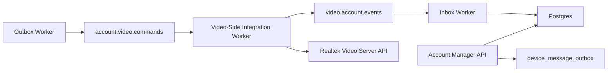

# Provisioning And Event Channel Development Plan

## Status

Living milestone tracker for the v2 provisioning and event-channel rollout.

This plan is derived from:

- `contracts/PROVISION.md`
- `contracts/CROSS_SERVICE_CHANNEL.md`
- `contracts/CONTRACT_OVERVIEW.md`
- `contracts/PRODUCT_ONBOARDING.md`
- `contracts/PRODUCT_READINESS.md`
- `docs/SPEC.md`

As of May 2026, `origin/main` includes the merged persistence, API, worker, broker, test-report, runbook, pending-metadata, lifecycle-admin, delete-policy, readiness-contract, private-cloud readiness, Claim Token resolution, registry-only readiness, and corresponding test-report slices for the v2 lifecycle milestone. The video-side lifecycle hardening previously tracked in `hkt999rtk/rtk_video_cloud#128`, `hkt999rtk/rtk_video_cloud#129`, `hkt999rtk/rtk_video_cloud#131`, and PR `hkt999rtk/rtk_video_cloud#146` is closed or merged.

## Current Implementation Snapshot

The current account manager now implements:

- Account-side provisioning and deactivation APIs with idempotent `device_operations`.
- Transactional outbox writes to `device_message_outbox`.
- Inbox deduplication and account-side projection from `video.account.events`.
- Metadata merge helpers for `video_cloud_*` fields and online/offline projection.
- Local `log` broker support plus Azure Event Hubs adapter wiring.
- Maintained v2 test reporting and a local worker runbook.
- Lifecycle admin commands for listing, inspecting, and requeueing eligible inbox/outbox rows.
- Hashed Claim Token persistence and the app-facing `POST /v1/orgs/:orgId/devices/claim/resolve` endpoint.
- Platform-admin Claim Token issuance/import/list/show/revoke endpoints.
- Machine-readable Claim Token resolve retryability hints.
- Registry-only readiness responses for existing devices before a provisioning operation exists.
- Readiness failure attribution for failed or dead-lettered provisioning/deactivation states.
- Platform-admin quota request visibility and audit-event visibility.
- Test-report coverage for Claim Token resolve/admin, registry-only readiness, failure attribution, admin visibility, OpenAPI contract validation, and correctness gates.

Verified contract follow-up closure for this milestone snapshot:

- Account-manager Claim Token persistence and `POST /v1/orgs/:orgId/devices/claim/resolve` are implemented.
- Platform-admin Claim Token issuance/import/revoke is implemented.
- Claim resolve retryability hints are implemented.
- `GET /provisioning` returns registry-only readiness for existing devices before a provisioning operation exists.
- Failed provisioning and deactivation states return `readiness.failure` attribution.
- `make test-report`, `docs/TESTING.md`, and `docs/TEST_REPORT.md` cover Claim Token, registry-only readiness, failure-attribution, admin visibility, OpenAPI, and correctness-gate behavior.

Remaining post-v2 contract follow-up gaps for this milestone snapshot:

- Implement the already-defined transfer, reclaim, and factory-reset policy for already-claimed devices.
- Define the unified cross-service product-readiness composition boundary beyond account-manager's current account-side readiness projection.
- Add operational lifecycle visibility around retry, dead-letter, and latency counts without requiring direct SQL.
- Harden production-like deployment evidence for backup freshness, restore drills, smoke checks, SMTP mode, and broker mode.
- Keep this repo's contract docs explicit that `DELETE /devices/:deviceId` remains registry-only while product teardown still requires `POST /deactivate`, unless product policy changes later.

## Milestone And Issue Map

Milestone: `v2-provisioning-event-channel`

| Issue | Priority | Labels | Depends on | Status | Evidence on `main` | Deliverable |
| --- | --- | --- | --- | --- | --- | --- |
| #1 `[Docs] Align SPEC with provisioning/event-channel v2 scope` | P0 | `docs`, `v2` | None | verified | `docs/SPEC.md`, `docs/TESTING.md` | `docs/SPEC.md` describes v2 APIs, data model, streams, statuses, metadata keys, and acceptance criteria. |
| #2 `[Docs] Add v2 implementation checklist and issue map` | P0 | `docs`, `v2` | None | in_progress | This tracker refresh | This document contains the issue map, dependency order, and status tracking. |
| #3 `[DB] Add device operations, outbox, and inbox persistence` | P1 | `database`, `backend`, `v2` | #1, #2 | implemented | PR #13 | Migrations and store methods for operation tracking, outbox publication state, and inbox dedupe. |
| #4 `[Domain] Add cross-service message envelope and payload validation` | P1 | `backend`, `v2` | #1, #2 | implemented | PR #12 | Envelope and payload types validate contract-required fields, stream/message types, schema version, and partition key. |
| #5 `[Device] Add metadata merge and projection primitives` | P1 | `backend`, `v2` | #3, #4 | implemented | PRs #14, #16, #17 | Store-level partial metadata merge and projection helpers for video metadata and online status. |
| #6 `[API] Add provisioning and deactivation endpoints` | P1 | `api`, `backend`, `v2` | #3, #4, #5 | implemented | PR #15 | HTTP endpoints create/reuse operations and enqueue lifecycle command messages. |
| #7 `[Worker] Implement outbox publisher with local broker adapter` | P1 | `worker`, `backend`, `v2` | #3, #4 | implemented | PRs #18, #21, #24, #26 | Independent worker publishes pending command messages and records retry/dead-letter state. |
| #8 `[Worker] Implement inbox consumer and account projection` | P1 | `worker`, `backend`, `v2` | #3, #4, #5 | implemented | PRs #19, #20 | Independent worker deduplicates events and projects provisioning, deactivation, online, and metadata state. |
| #9 `[Broker] Add Azure Event Hubs adapter and runtime config` | P2 | `worker`, `backend`, `v2` | #7, #8 | implemented | PR #22 | Event Hubs adapter and configuration without making local tests depend on Azure. |
| #10 `[Testing] Extend automated test report for v2` | P2 | `testing`, `v2` | #6, #7, #8 | verified | PR #23, `docs/TEST_REPORT.md` | `make test-report` includes v2 behavior evidence and keeps coverage at or above 80%. |
| #11 `[Docs] Add local runbook for provisioning/event workers` | P2 | `docs`, `v2` | #6, #7, #8, #9 | verified | PR #25, `README.md` | Local runbook for Postgres, API server, outbox worker, inbox worker, and local broker flow. |

## Contract Follow-Up Closure Map

These issues were follow-ups to the merged account-manager v2 implementation. They are now part of the verified mainline behavior and remain here as traceability evidence.

| Issue | Status | Evidence | Deliverable |
| --- | --- | --- | --- |
| `#87 [API/DB] Add Claim Token resolve persistence and policy model` | verified | PR #92, `openapi.yaml`, `docs/TEST_REPORT.md` | Hashed Claim Token persistence, claim/bind policy state, registry-device create/match behavior, and provisioning input projection. |
| `#88 [API] Implement POST /v1/orgs/:orgId/devices/claim/resolve` | verified | PR #93, `openapi.yaml`, `docs/SPEC.md` | App-facing Claim Token resolve endpoint defined by `contracts/PROVISION.md` and `contracts/PRODUCT_ONBOARDING.md`. |
| `#89 [API] Return registry-only readiness from GET /provisioning` | verified | PR #94, `docs/TEST_REPORT.md` | Account-side readiness for existing registry devices that have no provisioning operation yet. |
| `#90 [Testing] Extend report for Claim Token and readiness gaps` | verified | PR #95, `make test-report`, `docs/TESTING.md`, `docs/TEST_REPORT.md` | Maintained evidence for Claim Token and registry-only readiness correctness. |
| `#97 [API/DB] Add platform-admin Claim Token issuance/import workflow` | verified | PR #104, `openapi.yaml`, `docs/TEST_REPORT.md` | Platform-admin token create/import/list/show/revoke workflow with hashed token storage and raw generated token one-time return. |
| `#98 [API] Add retryability details to Claim Token resolve errors` | verified | PR #106, `openapi.yaml`, `docs/TEST_REPORT.md` | Claim resolve failures include machine-readable `retryable` and `resolution_action` hints. |
| `#99 [API] Add product-readiness failure attribution to GET /provisioning` | verified | PR #107, `openapi.yaml`, `docs/TEST_REPORT.md` | Failed provisioning/deactivation readiness responses expose `readiness.failure` attribution. |
| `#100 [Docs/Policy] Define claim transfer, reclaim, and factory-reset policy` | verified | PR #105, `docs/SPEC.md` | Claim transfer/reclaim/factory-reset policy baseline for platform-admin override work. |
| `#101 [API/Admin] Add platform-admin quota request and audit visibility` | verified | PR #108, `openapi.yaml`, `docs/TEST_REPORT.md` | Platform-admin quota request list/show and audit-event list endpoints. |
| `#102 [Testing] Extend report for post-v2 admin/readiness gaps` | verified | PR #109, `make test-report`, `docs/TESTING.md`, `docs/TEST_REPORT.md` | Maintained evidence for post-v2 admin/readiness behavior. |
| `#131 [API/Admin] Add Claim Token transfer and reclaim workflows` | verified | PR #139, `openapi.yaml`, `docs/TEST_REPORT.md` | Platform-admin transfer/reclaim override endpoints with required reason/evidence and audit events. |

Status values:

- `planned`: issue is defined but no implementation branch has started.
- `in_progress`: implementation is actively being updated on a branch or PR.
- `implemented`: the linked engineering slice is merged on `main`, but issue close-out may still lag in GitHub metadata.
- `verified`: merged scope is also reflected in maintained docs and test/report artifacts.

Documentation-first rule:

- The first change set updates `docs/SPEC.md`, this plan, and `docs/TESTING.md`.
- `openapi.yaml` is updated with the provisioning API implementation so the contract matches live handler behavior.
- README/runbook updates happen after worker commands and runtime configuration exist.
- After the initial rollout, subsequent milestone updates should refresh this tracker whenever merged scope changes on `main`.

## Target Architecture



Implementation rules:

- The API writes operations and outbox rows transactionally with account-manager state.
- The outbox worker publishes pending commands and records publish attempts.
- The inbox worker consumes events, deduplicates them, and projects results into account-manager state.
- The video-side integration worker is a separate runtime outside this repository, currently implemented in `rtk_video_cloud` `cmd/crossservice`.
- Broker-specific code must sit behind an adapter.
- The local implementation uses the `log` adapter; production-like lifecycle deployments may use the Azure Event Hubs adapter.

## Phase 1: Specification And Contract Alignment

Update source-of-truth documents before implementation:

- Extend `docs/SPEC.md` with v2 provisioning/event-channel scope.
- Keep v1 registry-only behavior documented as the current implemented baseline.
- Define account-manager-owned metadata keys:
  - `video_cloud_devid`
  - `video_cloud_activation_status`
  - `video_cloud_activity_id`
  - `video_cloud_activated_at`
  - `video_cloud_deactivated_at`
  - `video_cloud_last_error`
- Define operation statuses:
  - `pending`
  - `published`
  - `succeeded`
  - `failed`
  - `retrying`
  - `dead_lettered`
- Define supported message types:
  - `DeviceProvisionRequested`
  - `DeviceProvisionSucceeded`
  - `DeviceProvisionFailed`
  - `DeviceDeactivateRequested`
  - `DeviceDeactivateSucceeded`
  - `DeviceDeactivateFailed`
  - `DeviceOnlineChanged`
  - `DeviceMetadataChanged`

Deliverables:

- Updated `docs/SPEC.md`.
- Updated `openapi.yaml` only when new HTTP APIs are implemented.
- Updated test plan in `docs/TESTING.md`.

## Phase 2: Database Model

Add migrations for persistent operation and message tracking.

Recommended tables:

### `device_operations`

Tracks idempotent business operations.

Required fields:

- `id` UUID primary key.
- `operation_id` text unique.
- `correlation_id` text.
- `organization_id` UUID.
- `device_id` UUID.
- `operation_type` text, such as `provision` or `deactivate`.
- `status` text.
- `requested_by` UUID or text.
- `request_payload` JSONB.
- `result_payload` JSONB.
- `error_code` text nullable.
- `error_message` text nullable.
- `retryable` boolean nullable.
- `created_at`, `updated_at`, `completed_at`.

### `device_message_outbox`

Stores account-side commands before broker publication.

Required fields:

- `id` UUID primary key.
- `message_id` text unique.
- `operation_id` text.
- `correlation_id` text.
- `causation_id` text nullable.
- `stream` text, expected `account.video.commands`.
- `message_type` text.
- `schema_version` text.
- `partition_key` text.
- `payload` JSONB.
- `status` text, such as `pending`, `published`, `retrying`, `dead_lettered`.
- `attempt_count` integer.
- `last_error` text nullable.
- `available_at`, `published_at`, `created_at`, `updated_at`.

### `device_message_inbox`

Stores consumed video-side events and deduplication state.

Required fields:

- `id` UUID primary key.
- `message_id` text unique.
- `operation_id` text.
- `correlation_id` text.
- `causation_id` text nullable.
- `stream` text, expected `video.account.events`.
- `message_type` text.
- `schema_version` text.
- `partition_key` text.
- `payload` JSONB.
- `status` text, such as `processed`, `failed`, `retrying`, `dead_lettered`.
- `attempt_count` integer.
- `last_error` text nullable.
- `received_at`, `processed_at`, `created_at`, `updated_at`.

Constraints:

- `operation_id` uniqueness must prevent duplicate business side effects.
- `message_id` uniqueness must deduplicate broker redelivery.
- `partition_key` for device lifecycle messages must equal account-manager `device_id`.
- Message status values should use database checks.

## Phase 3: Metadata Merge Support

Add store-level support for partial metadata projection.

Required behavior:

- Read current device by `organization_id` and `device_id`.
- Merge namespaced `video_cloud_*` metadata fields.
- Preserve unrelated metadata fields.
- Reject projection into disabled devices unless the event type is deactivation result.
- Keep account-manager `status` separate from video activation status.

Suggested store method:

```go
MergeDeviceMetadata(ctx, orgID, deviceID string, patch map[string]any) (model.Device, error)
```

Testing:

- Existing metadata survives projection.
- `video_cloud_last_error` can be replaced by a newer failure.
- `DeviceProvisionSucceeded` does not set `status=online`.
- `DeviceOnlineChanged` may set `status=online|offline`.

## Phase 4: Provisioning API

Add account-side APIs for initiating and inspecting provisioning.

Suggested endpoints:

| Method | Path | Role | Purpose |
| --- | --- | --- | --- |
| `POST` | `/v1/orgs/:orgId/devices/:deviceId/provision` | owner/admin | Create or reuse a provisioning operation and enqueue `DeviceProvisionRequested`. |
| `GET` | `/v1/orgs/:orgId/devices/:deviceId/provisioning` | owner/admin/member | Return latest provisioning operation and projected video metadata. |
| `POST` | `/v1/orgs/:orgId/devices/:deviceId/deactivate` | owner/admin | Create or reuse a deactivation operation and enqueue `DeviceDeactivateRequested`. |

Provision request:

```json
{
  "video_cloud_devid": "device-1",
  "activity_id": "activity-1",
  "clip_public_key": "<clip-public-key>",
  "operation_id": "optional-client-idempotency-key"
}
```

Response:

```json
{
  "operation": {
    "operation_id": "op-01H...",
    "status": "pending",
    "device_id": "account-device-uuid",
    "message_id": "msg-01H..."
  }
}
```

Rules:

- `owner` and `admin` may initiate provisioning/deactivation.
- `member` may read provisioning state but may not initiate lifecycle commands.
- Device must exist in the organization.
- Disabled devices cannot be provisioned.
- Accepting provisioning immediately exposes pending `video_cloud_devid`, `video_cloud_activity_id`, `video_cloud_clip_public_key`, and `video_cloud_activation_status=pending` in projected device metadata.
- Duplicate `operation_id` with the same payload returns the existing operation.
- Duplicate `operation_id` with a conflicting payload returns `409 Conflict`.
- The API must not directly call Realtek video server.

## Phase 5: Message Envelope And Schema Validation

Add Go types for the common envelope and payloads.

Envelope fields:

- `message_id`
- `correlation_id`
- `causation_id`
- `operation_id`
- `source_service`
- `target_service`
- `message_type`
- `schema_version`
- `partition_key`
- `occurred_at`
- `payload`

Payload structs:

- `DeviceProvisionRequestedPayload`
- `DeviceProvisionSucceededPayload`
- `DeviceProvisionFailedPayload`
- `DeviceDeactivateRequestedPayload`
- `DeviceDeactivateSucceededPayload`
- `DeviceDeactivateFailedPayload`
- `DeviceOnlineChangedPayload`
- `DeviceMetadataChangedPayload`

Validation:

- Required fields must be non-empty.
- `schema_version` must be supported.
- Unknown `message_type` must be rejected or dead-lettered.
- `DeviceOnlineChanged.status` must be `online` or `offline`.
- Device lifecycle `partition_key` must equal account-manager `device_id`.

## Phase 6: Outbox Worker

Add an independent command:

```sh
go run ./cmd/outbox-worker
```

Responsibilities:

- Poll pending outbox rows.
- Publish to broker adapter.
- Mark rows as `published`.
- Retry transient failures.
- Mark poison messages as `dead_lettered`.
- Keep enough error context for investigation.

Producer interface:

```go
type Producer interface {
    Publish(ctx context.Context, stream string, envelope Envelope) error
}
```

Initial adapters:

- `log` adapter for local development.
- Azure Event Hubs adapter for production-like broker integration.

## Phase 7: Inbox Worker And Account-Side Projection

Add an independent command:

```sh
go run ./cmd/inbox-worker
```

Responsibilities:

- Consume events from `video.account.events`.
- Insert inbox rows by `message_id`.
- Deduplicate repeated deliveries.
- Apply idempotent projection by `operation_id`.
- Retry transient projection failures.
- Dead-letter invalid, unmapped, or poison messages.

Projection behavior:

- `DeviceProvisionSucceeded`
  - set operation `succeeded`
  - merge `video_cloud_activation_status=activated`
  - merge `video_cloud_activated_at`
  - clear or replace `video_cloud_last_error`
  - do not set account-manager `status=online`
- `DeviceProvisionFailed`
  - set operation `failed`
  - merge `video_cloud_activation_status=failed`
  - merge `video_cloud_last_error`
- `DeviceDeactivateSucceeded`
  - set operation `succeeded`
  - merge `video_cloud_activation_status=deactivated`
  - merge `video_cloud_deactivated_at`
- `DeviceDeactivateFailed`
  - set operation `failed`
  - merge `video_cloud_last_error`
  - do not silently treat product-level disable as complete
- `DeviceOnlineChanged`
  - set account-manager `status=online|offline`
  - set `last_seen_at`
- `DeviceMetadataChanged`
  - merge selected metadata fields without replacing unrelated metadata

## Phase 8: Broker Configuration

Add environment-driven configuration.

Suggested variables:

| Variable | Description |
| --- | --- |
| `CROSS_SERVICE_BROKER` | `log` or `azure_eventhubs`. |
| `ACCOUNT_VIDEO_COMMANDS_STREAM` | Logical command stream, default `account.video.commands`. |
| `VIDEO_ACCOUNT_EVENTS_STREAM` | Logical event stream, default `video.account.events`. |
| `CROSS_SERVICE_CONSUMER_GROUP` | Consumer group for account-side event projection. |
| `CROSS_SERVICE_MAX_ATTEMPTS` | Retry limit before dead-letter. |
| `CROSS_SERVICE_POLL_INTERVAL` | Worker polling interval. |
| `AZURE_EVENTHUB_CONNECTION_STRING` | Azure Event Hubs connection string when using Azure. |
| `AZURE_EVENTHUB_CHECKPOINT_FILE` | Optional durable checkpoint file for Azure inbox-consumer progress across worker restarts. |

Do not reuse Realtek video server `POST /setup_eventhub` configuration for this channel.

## Phase 9: Deactivation And Delete Semantics

Final policy: keep account-registry deletion and product-level deactivation distinct.

- `POST /deactivate` is the only account-manager API that starts product-level video teardown.
- `DELETE /devices/:deviceId` remains an account-registry soft-disable and does not enqueue `DeviceDeactivateRequested`.
- If the product-side device must be torn down, call `POST /deactivate`, wait for the corresponding terminal video-side result event, then optionally soft-delete the registry record.
- A failed deactivation must remain visible in metadata and operation state; registry delete alone must not be presented as completed product disablement.

## Phase 9.1: Product Readiness Contract

Product-level readiness is a composed multi-service state, not an
account-manager-owned final boolean. Account manager does expose an
account-side readiness projection for the facts it owns locally.

Contract rules:

- `rtk_account_manager` owns registry state, provisioning operation state,
  projected `video_cloud_*` metadata, and projected account-side
  `online|offline` status.
- Account-manager device categories are registry taxonomy values, not video
  credential scope names. Any category can participate in video-cloud
  provisioning when it has a valid `video_cloud_devid` mapping and lifecycle
  input.
- Realtek video server or the video-side integration layer owns token issuance,
  device-bound credentials, certificate lifecycle, video-side bootstrap
  prerequisites, and websocket/MQTT transport/session readiness inputs that do
  not live in account-manager state.
- `GET /provisioning` is the account-side lifecycle and readiness projection
  surface; it is not a unified product-readiness endpoint.
- Its `readiness.sources` object identifies the local source facts behind the
  aggregate state: registry enabled/disabled state, projected account device
  status, latest provisioning status, projected activation status, latest
  deactivation status, and projected video last-error data.
- Clients or an integrating service must compose final readiness from both
  account and video-side signals, including scoped token issuance and
  websocket/MQTT owner transport, until a future dedicated cross-service
  readiness API is explicitly designed and implemented.

Composition boundary:

| Fact | Owner | Current account-manager behavior | Future composition requirement |
| --- | --- | --- | --- |
| Registry and org membership | `rtk_account_manager` | Exposed through org/device APIs and `/provisioning`. | Required source for any product-readiness document. |
| Claim/bind result | `rtk_account_manager` | Exposed through Claim Token resolve and device metadata. | Required when readiness includes app onboarding state. |
| Provision/deactivate operation | `rtk_account_manager` | Exposed through `/provisioning` with failure attribution. | Required source with operation id, retryability, and timestamps. |
| Video activation projection | `rtk_account_manager` projection of `rtk_video_cloud` events | Exposed as projected `video_cloud_*` metadata. | Must identify video cloud as the source owner. |
| Subject-bound token issuance | Video cloud or integration auth service | Not owned by account manager. | Must be supplied by the owning service or reported as `unknown`. |
| Device info/config bootstrap | Product bootstrap or video cloud service | Not owned by account manager. | Must be supplied by the owning service or reported as `unknown`. |
| Owner transport/session | Video transport service, projected into account status | Account manager exposes projected `online|offline`. | Final readiness must distinguish projected account status from transport-owner diagnostics. |

Future endpoint options:

- Extend `GET /v1/orgs/:orgId/devices/:deviceId/provisioning` only with
  optional additive source summaries if existing clients remain compatible.
- Add `GET /v1/orgs/:orgId/devices/:deviceId/readiness` if account manager is
  chosen as the backend aggregator for cross-service readiness.
- Keep final composition outside this repo, for example in `rtk_cloud_admin` or
  an integration BFF, if dashboard/product UX owns the final product-ready
  decision.

Any future implementation must preserve org-scoped read authorization,
cross-organization non-disclosure, redaction of token/secret material, OpenAPI
contract validation, and a test-report correctness gate that is separate from
the existing account-side readiness gate.

Account-side readiness states:

- `activation_pending`
- `activation_failed`
- `transport_pending`
- `ready`
- `deactivation_pending`
- `deactivation_failed`
- `deactivated`
- `disabled`

`GET /provisioning` also exposes `readiness.product_state` with the shared
product-readiness vocabulary (`registered`, `cloud_activation_pending`,
`activated`, `online`, `failed`, `deactivation_pending`, `deactivated`) derived
from the same account-side source facts. `claim_pending` and
`local_onboarding_pending` are intentionally not emitted until account manager
owns durable facts for those phases.

Failure handling:

- Activation failure must stay visible through operation error fields and
  projected metadata.
- Missing scoped-token, certificate, bootstrap, or owner-transport prerequisites
  after activation must surface as post-activation readiness gaps, not as fake
  activation success.
- `status=online` alone does not prove full provisioning readiness.

## Phase 10: Testing And Reporting

Extend automated tests and `make test-report`.

Required tests:

- Provision API success creates operation and outbox row.
- Provision API rejects disabled or cross-organization devices.
- Provision API enforces owner/admin roles.
- Duplicate `operation_id` with same payload is idempotent.
- Duplicate `operation_id` with conflicting payload returns `409`.
- Outbox worker publishes and marks messages as published.
- Outbox worker retries and dead-letters failed messages.
- Inbox worker deduplicates by `message_id`.
- Inbox projection is idempotent by `operation_id`.
- `DeviceProvisionSucceeded` updates metadata but not account status.
- `DeviceProvisionFailed` records retryable failure metadata.
- `DeviceDeactivateSucceeded` records deactivation metadata.
- `DeviceDeactivateFailed` does not hide product-level failure.
- `DeviceOnlineChanged` updates account status and `last_seen_at`.
- `DeviceMetadataChanged` merges metadata without overwriting unrelated fields.
- Unknown message type is rejected or dead-lettered.
- Invalid schema version is rejected or dead-lettered.
- OpenAPI contract tests cover new endpoints.

Coverage threshold remains 80% minimum, but correctness assertions and behavior evidence in `docs/TEST_REPORT.md` must be updated with provisioning and event-channel behavior groups.

## Phase 11: Rollout Order

Recommended implementation sequence:

1. Add database migrations and store methods for operations/outbox/inbox.
2. Add envelope and payload models with validation.
3. Add metadata merge store method.
4. Add provisioning/deactivation APIs with outbox writes.
5. Add local/log broker adapter.
6. Add outbox worker.
7. Add inbox projection service with test-driven projections.
8. Add inbox worker with local/log adapter tests.
9. Update OpenAPI and docs.
10. Add Azure Event Hubs adapter.
11. Add operational dashboards/logging around retry and dead-letter counts.

## Acceptance Criteria

V2 provisioning/event-channel support is acceptable when:

- Account-side provisioning and deactivation APIs are documented in OpenAPI.
- Provisioning creates idempotent operation records.
- Account-side lifecycle commands are persisted in an outbox before publication.
- Outbox worker publishes `DeviceProvisionRequested` and `DeviceDeactivateRequested`.
- Inbox worker consumes all v1 video/account event types.
- Duplicate message delivery does not cause duplicate side effects.
- Projection merges metadata safely.
- Activation success does not imply account-manager `online`.
- Online/offline projection updates account-manager status only from `DeviceOnlineChanged`.
- Retry and dead-letter state are inspectable in the database.
- Local development can run without Azure using the `log` broker adapter.
- Automated tests cover the behavior matrix and report correctness evidence.
