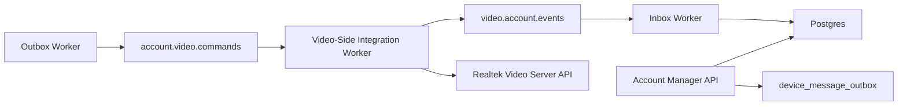

# Provisioning And Event Channel Development Plan

## Status

Planning document for the next implementation phase after the current v1 registry-only backend.

This plan is derived from:

- `contracts/PROVISION.md`
- `contracts/CROSS_SERVICE_CHANNEL.md`
- `contracts/CONTRACT_OVERVIEW.md`
- `docs/SPEC.md`

The current codebase does not yet implement provisioning, broker publication, event consumption, or cross-service projection.

## Current Gap Summary

The current account manager implements organization-scoped users, roles, JWT auth, refresh tokens, device registry CRUD, device status updates, OpenAPI validation, and automated tests.

The contracts require additional account-side behavior:

- Publish account-side lifecycle commands to `account.video.commands`.
- Consume video-side results and projections from `video.account.events`.
- Track provisioning/deactivation operations using `operation_id`.
- Treat delivery as at-least-once and handle duplicate messages safely.
- Store retryable and dead-letter states for failed cross-service messages.
- Map account-manager device IDs to Realtek video server `devid` values.
- Merge provisioning metadata without overwriting unrelated account-manager metadata.
- Avoid treating activation success as account-manager `online` status.
- Keep the cross-service channel runtime as an independent process.

## Milestone And Issue Map

Milestone: `v2-provisioning-event-channel`

| Issue | Priority | Labels | Depends on | Status | Deliverable |
| --- | --- | --- | --- | --- | --- |
| `[Docs] Align SPEC with provisioning/event-channel v2 scope` | P0 | `docs`, `v2` | None | planned | `docs/SPEC.md` describes v2 APIs, data model, streams, statuses, metadata keys, and acceptance criteria. |
| `[Docs] Add v2 implementation checklist and issue map` | P0 | `docs`, `v2` | None | planned | This document contains the issue map, dependency order, and status tracking. |
| `[DB] Add device operations, outbox, and inbox persistence` | P1 | `database`, `backend`, `v2` | Docs issues | in_progress | Migrations and store methods for operation tracking, outbox publication state, and inbox dedupe. |
| `[Domain] Add cross-service message envelope and payload validation` | P1 | `backend`, `v2` | Docs issues | in_progress | Envelope and payload types validate contract-required fields, stream/message types, schema version, and partition key. |
| `[Device] Add metadata merge and projection primitives` | P1 | `backend`, `v2` | DB, Domain | in_progress | Store-level partial metadata merge and projection helpers for video metadata and online status. |
| `[API] Add provisioning and deactivation endpoints` | P1 | `api`, `backend`, `v2` | DB, Domain, Device | planned | HTTP endpoints create/reuse operations and enqueue lifecycle command messages. |
| `[Worker] Implement outbox publisher with local broker adapter` | P1 | `worker`, `backend`, `v2` | DB, Domain | planned | Independent worker publishes pending command messages and records retry/dead-letter state. |
| `[Worker] Implement inbox consumer and account projection` | P1 | `worker`, `backend`, `v2` | DB, Domain, Device | planned | Independent worker deduplicates events and projects provisioning, deactivation, online, and metadata state. |
| `[Broker] Add Azure Event Hubs adapter and runtime config` | P2 | `worker`, `backend`, `v2` | Local workers | planned | Event Hubs adapter and configuration without making local tests depend on Azure. |
| `[Testing] Extend automated test report for v2` | P2 | `testing`, `v2` | API, Workers | planned | `make test-report` includes v2 behavior evidence and keeps coverage at or above 80%. |
| `[Docs] Add local runbook for provisioning/event workers` | P2 | `docs`, `v2` | API, Workers, Broker config | planned | Local runbook for Postgres, API server, outbox worker, inbox worker, and local broker flow. |

Status values:

- `planned`: issue is defined but implementation has not started.
- `in_progress`: implementation PR is active.
- `implemented`: code is merged but final report/runbook may still need update.
- `verified`: tests and maintained documentation are complete.

Documentation-first rule:

- The first change set updates `docs/SPEC.md`, this plan, and `docs/TESTING.md`.
- `openapi.yaml` is updated with the provisioning API implementation so the contract matches live handler behavior.
- README/runbook updates happen after worker commands and runtime configuration exist.

## Target Architecture



Implementation rules:

- The API writes operations and outbox rows transactionally with account-manager state.
- The outbox worker publishes pending commands and records publish attempts.
- The inbox worker consumes events, deduplicates them, and projects results into account-manager state.
- Broker-specific code must sit behind an adapter.
- The first local implementation may use a log/noop/file adapter before Azure Event Hubs is integrated.

## Phase 1: Specification And Contract Alignment

Update source-of-truth documents before implementation:

- Extend `docs/SPEC.md` with v2 provisioning/event-channel scope.
- Keep v1 registry-only behavior documented as the current implemented baseline.
- Define account-manager-owned metadata keys:
  - `video_cloud_devid`
  - `video_cloud_activation_status`
  - `video_cloud_activity_id`
  - `video_cloud_activated_at`
  - `video_cloud_deactivated_at`
  - `video_cloud_last_error`
- Define operation statuses:
  - `pending`
  - `published`
  - `succeeded`
  - `failed`
  - `retrying`
  - `dead_lettered`
- Define supported message types:
  - `DeviceProvisionRequested`
  - `DeviceProvisionSucceeded`
  - `DeviceProvisionFailed`
  - `DeviceDeactivateRequested`
  - `DeviceDeactivateSucceeded`
  - `DeviceDeactivateFailed`
  - `DeviceOnlineChanged`
  - `DeviceMetadataChanged`

Deliverables:

- Updated `docs/SPEC.md`.
- Updated `openapi.yaml` only when new HTTP APIs are implemented.
- Updated test plan in `docs/TESTING.md`.

## Phase 2: Database Model

Add migrations for persistent operation and message tracking.

Recommended tables:

### `device_operations`

Tracks idempotent business operations.

Required fields:

- `id` UUID primary key.
- `operation_id` text unique.
- `correlation_id` text.
- `organization_id` UUID.
- `device_id` UUID.
- `operation_type` text, such as `provision` or `deactivate`.
- `status` text.
- `requested_by` UUID or text.
- `request_payload` JSONB.
- `result_payload` JSONB.
- `error_code` text nullable.
- `error_message` text nullable.
- `retryable` boolean nullable.
- `created_at`, `updated_at`, `completed_at`.

### `device_message_outbox`

Stores account-side commands before broker publication.

Required fields:

- `id` UUID primary key.
- `message_id` text unique.
- `operation_id` text.
- `correlation_id` text.
- `causation_id` text nullable.
- `stream` text, expected `account.video.commands`.
- `message_type` text.
- `schema_version` text.
- `partition_key` text.
- `payload` JSONB.
- `status` text, such as `pending`, `published`, `retrying`, `dead_lettered`.
- `attempt_count` integer.
- `last_error` text nullable.
- `available_at`, `published_at`, `created_at`, `updated_at`.

### `device_message_inbox`

Stores consumed video-side events and deduplication state.

Required fields:

- `id` UUID primary key.
- `message_id` text unique.
- `operation_id` text.
- `correlation_id` text.
- `causation_id` text nullable.
- `stream` text, expected `video.account.events`.
- `message_type` text.
- `schema_version` text.
- `partition_key` text.
- `payload` JSONB.
- `status` text, such as `processed`, `failed`, `retrying`, `dead_lettered`.
- `attempt_count` integer.
- `last_error` text nullable.
- `received_at`, `processed_at`, `created_at`, `updated_at`.

Constraints:

- `operation_id` uniqueness must prevent duplicate business side effects.
- `message_id` uniqueness must deduplicate broker redelivery.
- `partition_key` for device lifecycle messages must equal account-manager `device_id`.
- Message status values should use database checks.

## Phase 3: Metadata Merge Support

Add store-level support for partial metadata projection.

Required behavior:

- Read current device by `organization_id` and `device_id`.
- Merge namespaced `video_cloud_*` metadata fields.
- Preserve unrelated metadata fields.
- Reject projection into disabled devices unless the event type is deactivation result.
- Keep account-manager `status` separate from video activation status.

Suggested store method:

```go
MergeDeviceMetadata(ctx, orgID, deviceID string, patch map[string]any) (model.Device, error)
```

Testing:

- Existing metadata survives projection.
- `video_cloud_last_error` can be replaced by a newer failure.
- `DeviceProvisionSucceeded` does not set `status=online`.
- `DeviceOnlineChanged` may set `status=online|offline`.

## Phase 4: Provisioning API

Add account-side APIs for initiating and inspecting provisioning.

Suggested endpoints:

| Method | Path | Role | Purpose |
| --- | --- | --- | --- |
| `POST` | `/v1/orgs/:orgId/devices/:deviceId/provision` | owner/admin | Create or reuse a provisioning operation and enqueue `DeviceProvisionRequested`. |
| `GET` | `/v1/orgs/:orgId/devices/:deviceId/provisioning` | owner/admin/member | Return latest provisioning operation and projected video metadata. |
| `POST` | `/v1/orgs/:orgId/devices/:deviceId/deactivate` | owner/admin | Create or reuse a deactivation operation and enqueue `DeviceDeactivateRequested`. |

Provision request:

```json
{
  "video_cloud_devid": "device-1",
  "activity_id": "activity-1",
  "clip_public_key": "<clip-public-key>",
  "operation_id": "optional-client-idempotency-key"
}
```

Response:

```json
{
  "operation": {
    "operation_id": "op-01H...",
    "status": "pending",
    "device_id": "account-device-uuid",
    "message_id": "msg-01H..."
  }
}
```

Rules:

- `owner` and `admin` may initiate provisioning/deactivation.
- `member` may read provisioning state but may not initiate lifecycle commands.
- Device must exist in the organization.
- Disabled devices cannot be provisioned.
- Duplicate `operation_id` with the same payload returns the existing operation.
- Duplicate `operation_id` with a conflicting payload returns `409 Conflict`.
- The API must not directly call Realtek video server.

## Phase 5: Message Envelope And Schema Validation

Add Go types for the common envelope and payloads.

Envelope fields:

- `message_id`
- `correlation_id`
- `causation_id`
- `operation_id`
- `source_service`
- `target_service`
- `message_type`
- `schema_version`
- `partition_key`
- `occurred_at`
- `payload`

Payload structs:

- `DeviceProvisionRequestedPayload`
- `DeviceProvisionSucceededPayload`
- `DeviceProvisionFailedPayload`
- `DeviceDeactivateRequestedPayload`
- `DeviceDeactivateSucceededPayload`
- `DeviceDeactivateFailedPayload`
- `DeviceOnlineChangedPayload`
- `DeviceMetadataChangedPayload`

Validation:

- Required fields must be non-empty.
- `schema_version` must be supported.
- Unknown `message_type` must be rejected or dead-lettered.
- `DeviceOnlineChanged.status` must be `online` or `offline`.
- Device lifecycle `partition_key` must equal account-manager `device_id`.

## Phase 6: Outbox Worker

Add an independent command:

```sh
go run ./cmd/outbox-worker
```

Responsibilities:

- Poll pending outbox rows.
- Publish to broker adapter.
- Mark rows as `published`.
- Retry transient failures.
- Mark poison messages as `dead_lettered`.
- Keep enough error context for investigation.

Producer interface:

```go
type Producer interface {
    Publish(ctx context.Context, stream string, envelope Envelope) error
}
```

Initial adapters:

- `log` adapter for local development.
- `file` adapter for deterministic tests.
- Azure Event Hubs adapter later.

## Phase 7: Inbox Worker And Account-Side Projection

Add an independent command:

```sh
go run ./cmd/inbox-worker
```

Responsibilities:

- Consume events from `video.account.events`.
- Insert inbox rows by `message_id`.
- Deduplicate repeated deliveries.
- Apply idempotent projection by `operation_id`.
- Retry transient projection failures.
- Dead-letter invalid, unmapped, or poison messages.

Projection behavior:

- `DeviceProvisionSucceeded`
  - set operation `succeeded`
  - merge `video_cloud_activation_status=activated`
  - merge `video_cloud_activated_at`
  - clear or replace `video_cloud_last_error`
  - do not set account-manager `status=online`
- `DeviceProvisionFailed`
  - set operation `failed`
  - merge `video_cloud_activation_status=failed`
  - merge `video_cloud_last_error`
- `DeviceDeactivateSucceeded`
  - set operation `succeeded`
  - merge `video_cloud_activation_status=deactivated`
  - merge `video_cloud_deactivated_at`
- `DeviceDeactivateFailed`
  - set operation `failed`
  - merge `video_cloud_last_error`
  - do not silently treat product-level disable as complete
- `DeviceOnlineChanged`
  - set account-manager `status=online|offline`
  - set `last_seen_at`
- `DeviceMetadataChanged`
  - merge selected metadata fields without replacing unrelated metadata

## Phase 8: Broker Configuration

Add environment-driven configuration.

Suggested variables:

| Variable | Description |
| --- | --- |
| `CROSS_SERVICE_BROKER` | `log`, `file`, `azure_eventhubs`, or equivalent. |
| `ACCOUNT_VIDEO_COMMANDS_STREAM` | Logical command stream, default `account.video.commands`. |
| `VIDEO_ACCOUNT_EVENTS_STREAM` | Logical event stream, default `video.account.events`. |
| `CROSS_SERVICE_CONSUMER_GROUP` | Consumer group for account-side event projection. |
| `CROSS_SERVICE_MAX_ATTEMPTS` | Retry limit before dead-letter. |
| `CROSS_SERVICE_POLL_INTERVAL` | Worker polling interval. |
| `AZURE_EVENTHUB_CONNECTION_STRING` | Azure Event Hubs connection string when using Azure. |

Do not reuse Realtek video server `POST /setup_eventhub` configuration for this channel.

## Phase 9: Deactivation And Delete Semantics

Keep account registry deletion and product-level deactivation distinct.

Recommended behavior:

- `POST /deactivate` starts product-level deactivation.
- `DELETE /devices/:deviceId` remains account-registry soft-disable.
- If product policy requires delete to trigger deactivation, delete should enqueue `DeviceDeactivateRequested` and mark metadata as `video_cloud_activation_status=deactivation_pending`.
- A failed deactivation must be visible in metadata and operation state.

## Phase 10: Testing And Reporting

Extend automated tests and `make test-report`.

Required tests:

- Provision API success creates operation and outbox row.
- Provision API rejects disabled or cross-organization devices.
- Provision API enforces owner/admin roles.
- Duplicate `operation_id` with same payload is idempotent.
- Duplicate `operation_id` with conflicting payload returns `409`.
- Outbox worker publishes and marks messages as published.
- Outbox worker retries and dead-letters failed messages.
- Inbox worker deduplicates by `message_id`.
- Inbox projection is idempotent by `operation_id`.
- `DeviceProvisionSucceeded` updates metadata but not account status.
- `DeviceProvisionFailed` records retryable failure metadata.
- `DeviceDeactivateSucceeded` records deactivation metadata.
- `DeviceDeactivateFailed` does not hide product-level failure.
- `DeviceOnlineChanged` updates account status and `last_seen_at`.
- `DeviceMetadataChanged` merges metadata without overwriting unrelated fields.
- Unknown message type is rejected or dead-lettered.
- Invalid schema version is rejected or dead-lettered.
- OpenAPI contract tests cover new endpoints.

Coverage threshold remains 80% minimum, but correctness assertions and behavior evidence in `docs/TEST_REPORT.md` must be updated with provisioning and event-channel behavior groups.

## Phase 11: Rollout Order

Recommended implementation sequence:

1. Add database migrations and store methods for operations/outbox/inbox.
2. Add envelope and payload models with validation.
3. Add metadata merge store method.
4. Add provisioning/deactivation APIs with outbox writes.
5. Add local/log broker adapter.
6. Add outbox worker.
7. Add inbox projection service with test-driven projections.
8. Add inbox worker with local/file adapter tests.
9. Update OpenAPI and docs.
10. Add Azure Event Hubs adapter.
11. Add operational dashboards/logging around retry and dead-letter counts.

## Acceptance Criteria

V2 provisioning/event-channel support is acceptable when:

- Account-side provisioning and deactivation APIs are documented in OpenAPI.
- Provisioning creates idempotent operation records.
- Account-side lifecycle commands are persisted in an outbox before publication.
- Outbox worker publishes `DeviceProvisionRequested` and `DeviceDeactivateRequested`.
- Inbox worker consumes all v1 video/account event types.
- Duplicate message delivery does not cause duplicate side effects.
- Projection merges metadata safely.
- Activation success does not imply account-manager `online`.
- Online/offline projection updates account-manager status only from `DeviceOnlineChanged`.
- Retry and dead-letter state are inspectable in the database.
- Local development can run without Azure using a local broker adapter.
- Automated tests cover the behavior matrix and report correctness evidence.
