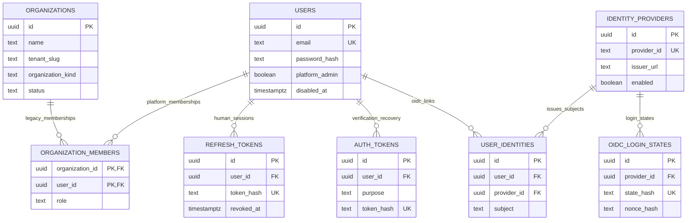
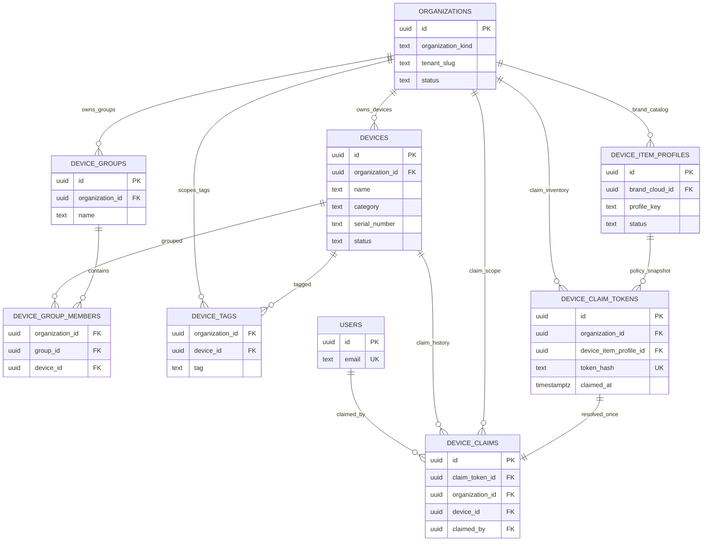
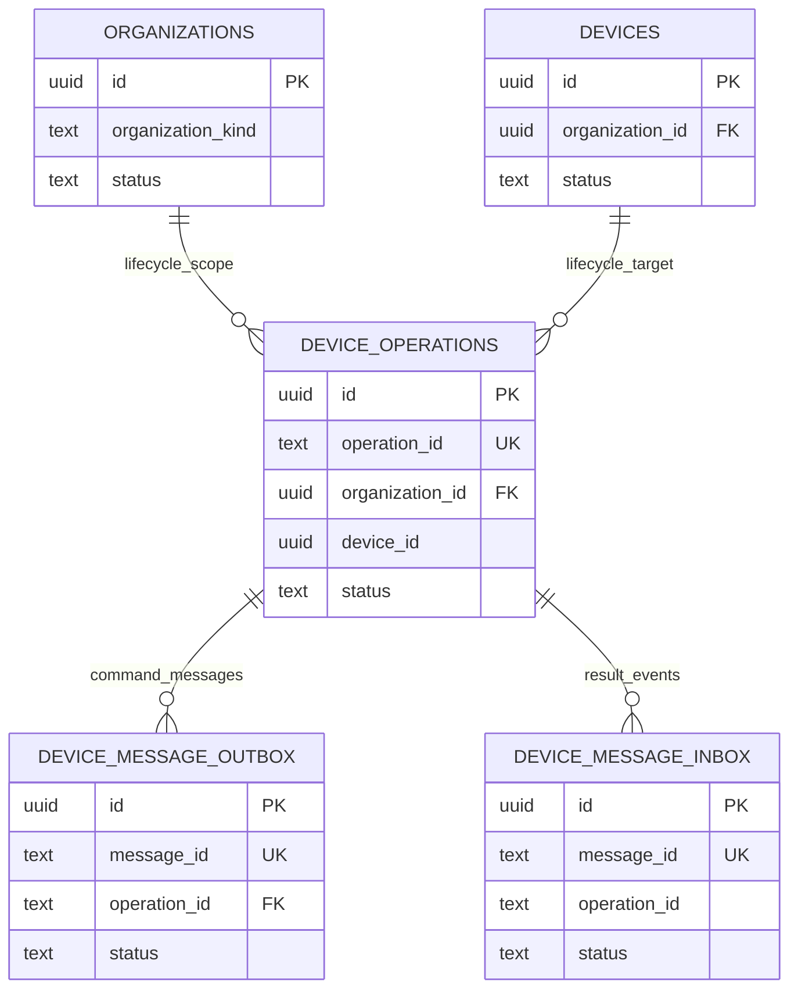
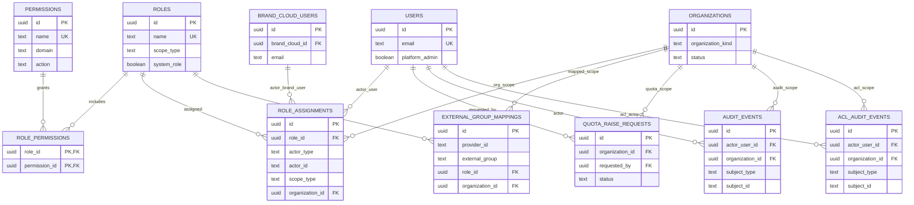

---
rtk_spec:
  id: SPEC-AM
  status: normative
  owner: rtk_account_manager
  requirement_inventory: complete
---

# Account Manager Backend Specification

## 1. Product Goal

Build a backend account and device manager similar in spirit to Amazon IoT Device Manager. The system manages user accounts, organizations, and device registries for devices such as IP cameras, MQTT devices, and generic connected devices.

The v1 service is a REST API backend only. It stores account and device state in Postgres and provides authentication, organization membership, role-based authorization, and registry-only device management.

This service is not a Web UI or dashboard. Enterprise dashboard UX, BFF routes,
console-local sessions, preferences, and non-authoritative display caches belong
to `rtk_cloud_admin`. This service remains the authoritative backend control
plane for identity, tenant context, authorization, entitlement, device registry,
and provisioning intent.

Provisioning and account/video event-channel integration are the v2 surface
implemented by this repository. The normative product boundary lives in
`docs/rtk_cloud_contracts_doc/provision.md` and
`docs/rtk_cloud_contracts_doc/cross_service_channel.md`;
[provisioning_and_event_channel_plan.md](provisioning_and_event_channel_plan.md)
[job_authorization.md](job_authorization.md) defines restricted background-job
delegation used by Cloud Admin batch orchestration.
tracks rollout history and verification status.

## 2. V1 Scope

### Included

- Go backend server using Gin.
- Postgres persistence.
- SQL migrations for schema management.
- Email/password authentication.
- Authenticated current-user password change.
- Authenticated current-user account disable/delete.
- JWT-based API authentication.
- Refresh-token support for longer sessions.
- Organization-based account model.
- Platform-admin brand cloud management with
  `organizations.organization_kind=brand_cloud` and global users linked through
  `organization_members`; Brand Clouds are authorization scopes, not identity
  namespaces.
- Platform Admin bootstrap and lifecycle, and the separation between Account
  Manager authority and PKI Root key custody, conform to canonical
  [platform_pki.md](rtk_cloud_contracts_doc/platform_pki.md). Account Manager
  owns the administrator identity and immutable Brand/Product selection facts;
  it never owns or returns CA private keys.
- Multiple users per organization.
- Role-based access control with `owner`, `admin`, `member`, and read-only `viewer`.

The multi-cloud target behavior and implementation boundaries are specified in
[multicloud_implementation.md](multicloud_implementation.md) and canonical
[multicloud_ownership.md](rtk_cloud_contracts_doc/multicloud_ownership.md)
in the contracts repository ([canonical design PR](https://github.com/hkt999rtk/rtk_cloud_contracts_doc/pull/131)).
Runtime delivery follows the reviewed docs-only gate.
- Owner-managed organization profile updates.
- Organization-owned devices.
- Organization-scoped device groups and device tags for fleet selection.
- Device categories:
  - `ip_camera`
  - `mqtt_device`
  - `generic`
- Device CRUD operations.
- Device status management.
- OpenAPI YAML as the API contract source of truth.
- Docker Compose based local Postgres environment.

### Out of Scope

- Frontend UI.
- MQTT broker integration.
- Camera streaming.
- Telemetry ingestion.
- Device command dispatch.
- Device self-registration or provisioning flows in v1.
- Device certificate management.
- Third-party/social login outside the supported Keycloak/OIDC integration path.
- Executable batch operations, OTA campaign execution, and firmware rollout policy.
- Custom RBAC permissions.
- Multi-region deployment concerns.

## 2.1 V2 Scope: Provisioning And Cross-Service Lifecycle Delivery

The shared contracts in `docs/rtk_cloud_contracts_doc/` define the product-level integration boundary between account manager and Realtek video server.

V2 adds:

- Account-side provisioning operation APIs for organization-owned registry devices.
- Explicit account-manager to Realtek video server identity mapping, especially `video_cloud_devid`.
- Durable lifecycle command delivery from the Account Manager outbox to the authenticated Video service API.
- Transactional result projection through the Account Manager inbox.
- Idempotent operation tracking with `operation_id`.
- Outbox/inbox persistence for at-least-once delivery.
- Retry and dead-letter state for failed cross-service messages.
- Account-side projection of provisioning, deactivation, online-state, and selected metadata events.
- Metadata merge support so cross-service projections do not overwrite unrelated device metadata.
- A `direct_http` production adapter plus legacy broker adapters for compatibility and local channel testing.

V2 excludes:

- Merge the cross-service channel runtime into the account-manager API process.
- Treat Realtek video server activation as equivalent to account-manager `online` status.
- Use Realtek video server `POST /setup_eventhub` as the account/video cross-service channel.
- Assume account-manager device UUID and Realtek video server `devid` are the same unless deliberately configured by integration.

V2 logical streams:

| Stream | Direction | Purpose |
| --- | --- | --- |
| `account.video.commands` | Account Manager durable outbox to Video service API | Device lifecycle commands that request Realtek video server side effects. |
| `video.account.events` | Video result to Account Manager inbox projection | Device lifecycle results and state projections consumed by account manager. |

V2 message types:

- `DeviceProvisionRequested`
- `DeviceProvisionSucceeded`
- `DeviceProvisionFailed`
- `DeviceDeactivateRequested`
- `DeviceDeactivateSucceeded`
- `DeviceDeactivateFailed`
- `DeviceOnlineChanged`
- `DeviceMetadataChanged`

V2 operation and message statuses:

- `pending`
- `published`
- `succeeded`
- `failed`
- `retrying`
- `dead_lettered`

Account-manager-owned video metadata keys:

- `video_cloud_devid`
- `video_cloud_activation_status`
- `video_cloud_activity_id`
- `video_cloud_activated_at`
- `video_cloud_deactivated_at`
- `video_cloud_last_error`

## 2.2 Persistence Boundary Refactor Direction

Account Manager is the highest-priority repository for the workspace
persistence/cache refactor because API handlers and workers currently depend on
the concrete Postgres-backed `internal/store.Store`. Future Redis-compatible
cache support begins with narrow persistence ports for auth/session, user,
organization, device, lifecycle, and metrics reads while
`internal/store.Store` remains the durable Postgres adapter. The refactor
preserves public HTTP APIs and keeps correctness-critical write transactions,
ACL permission decisions, quota mutation, and provisioning lifecycle
transitions in Postgres.

The cross-repository roadmap is maintained in
`../../docs/persistence-cache-refactor-roadmap.md`.

## 2.3 Keycloak / OIDC Authentication

Keycloak/OIDC SSO is supported as an external authentication capability.
Keycloak is an external identity provider; account manager remains the
authoritative owner of local users, organization memberships, roles, device
authorization, refresh tokens, and API JWT issuance.

The detailed normative specification for this capability is
[keycloak_oidc_sso.md](keycloak_oidc_sso.md). This section summarizes the
top-level product decisions so the main SPEC remains readable.

First implementation decisions:

- OIDC uses an account-manager backend callback flow. The backend redirects the
  browser to Keycloak, receives the authorization-code callback, validates the
  OIDC response, and returns the existing account-manager token response shape.
- Local email/password login remains supported.
- User provisioning is pre-provision only. OIDC login never creates a local
  user, organization, or membership.
- Organization authorization is resolved from account-manager persisted ACL
  facts. Keycloak groups, realm roles, and client roles grant no permissions
  unless an account-manager `external_group_mappings` row maps the external
  group to a scoped product role assignment.
- Successful SSO login issues account-manager access and refresh JWTs. Clients
  keep using `Authorization: Bearer <account-manager-access-token>` for API
  calls.
- The implementation supports one active Keycloak/OIDC provider, resolved from
  an enabled database provider first and environment configuration as a
  fallback.
- Platform-admin provider CRUD stores only secret references such as
  `env:OIDC_CLIENT_SECRET`; raw client secrets are not stored or returned.

This scope does not:

- Embed or operate Keycloak inside account manager.
- Persist Keycloak access tokens or refresh tokens.
- Treat Keycloak as the source of account-manager organization ownership,
  membership, role, or device access policy.
- Auto-link an arbitrary external identity to a local user without the configured
  account-manager policy allowing that link.

## [FEAT-AM-SIGNUP-001] Account signup, email activation, and session

<!-- rtk-feature
{"owner":"cloud_platform","risk":"critical","status":"active","change_paths":["repos/rtk_account_manager/**","repos/rtk_cloud_admin/**","scripts/go/rtk-cloud/main.go","scripts/staging_email_signup_e2e.py"],"commit_anchors":["workspace","account_manager","cloud_admin"],"surfaces":[{"kind":"operator-workflow","source":"scripts/staging_email_signup_e2e.py","selector":"RUN_LIVE_EMAIL_E2E=1"},{"kind":"operator-workflow","source":"scripts/go/rtk-cloud/main.go","selector":"email-activate-owners"}]}
-->

### [REQ-AM-EMAIL-DELIVERY-001] One-time human account email is global, enumeration-safe, and delivered through the configured outbox adapter

<!-- rtk-requirement
{"acceptance_layer":"integration","operation_model":"independent","gate":"pr","environments":["ci","staging"],"evidence":["json","junit"],"required":true,"status":"active"}
-->

Account Manager supports an email activation lifecycle for Admin Console login
and password recovery. The API is backend-only; `rtk_cloud_admin` owns the
browser routes, local session cookie, and display states.

Console user sign-in is split into two steps:

1. `POST /v1/auth/sign-in` accepts an email address and, when the user is an
   eligible platform/customer console user, creates a one-time
   `login_activation` token.
2. `POST /v1/auth/login/activate` consumes the one-time token and issues the
   same access/refresh token response shape as password login.

Platform operators, developers, and Brand Cloud owners/admins/members all use
those global endpoints. Brand Cloud is selected from `/v1/me` memberships after
authentication and is never an input to identity proof.

Enumeration safety is mandatory. Sign-in and forgot-password request endpoints
return `202 Accepted` for syntactically valid requests whether the email is
unknown, disabled, pending activation, rate limited, or eligible. Raw tokens are
never returned in HTTP responses. Delivery always transactionally writes
encrypted jobs to `email_outbox`. `rtk-account-manager-email-worker` delivers
them through the configured HTTPS Send Mail origin with Bearer authentication,
bounded retry, and dead-letter handling. The delivery path uses
`EMAIL_OUTBOX_ENCRYPTION_KEY`, `AUTH_TOKEN_BASE_URL`,
`SENDMAIL_HTTP_BASE_URL`, `SENDMAIL_HTTP_BEARER_TOKEN`, and
`SENDMAIL_HTTP_TIMEOUT`.

`auth_tokens` stores only token hashes. Human console login, email verification,
and password reset use the global user subject and empty tenant scope. Token
purposes are:

- `email_verification`: signup verification.
- `login_activation`: email sign-in activation.
- `password_reset`: forgot-password/reset-password activation.

Forgot password uses the same email activation lifecycle:

1. `POST /v1/auth/forgot-password` creates a `password_reset` token when
   applicable and still returns `202 Accepted` for non-eligible emails.
2. `POST /v1/auth/reset-password` consumes the token, writes the new password
   hash, and revokes active refresh tokens.

Password login remains available through the single `/v1/auth/login` endpoint.
APP end users remain a separate identity class under `/v1/app/end-users/*`.

### [REQ-E2E-CA-SIGNUP-EMAIL-001] Cloud Send Mail and IMAP customer signup activation completes

<!-- rtk-requirement
{"acceptance_layer":"live","operation_model":"workflow","gate":"operator-release","environments":["staging"],"evidence":["json","logs"],"freshness_hours":168,"required":true,"status":"active"}
-->

Acceptance: Cloud Send Mail and IMAP customer signup activation completes.

### [REQ-E2E-LOAD-ACCOUNT-001] Load-test Brand owners complete formal email activation

<!-- rtk-requirement
{"acceptance_layer":"live","gate":"operator-release","environments":["staging"],"evidence":["json","logs"],"freshness_hours":168,"required":true,"status":"active"}
-->

Acceptance: Load-test Brand owners complete formal email activation.

`POST /v1/admin/brand-clouds/:brandCloudId/users` always targets global `users`
plus `organization_members`:

- This existing-cloud endpoint accepts only `admin` or `member`, never owner
  assignment or mutation of the existing owner. Initial owner assignment belongs
  to atomic cloud creation/bootstrap; pending owners require global email
  activation, with no password or token exposed in provisioning responses.
- `activation_mode=email` creates/reuses an eligible non-owner global user and
  sends its global activation/assignment email without exposing credentials.
- `activation_mode=immediate` is accepted only when a staging/load-test feature
  flag is enabled, only for `admin` or `member`, and only from an authenticated
  platform admin. It requires an initial password for a new user and records the
  actor, reason, target user, Brand Cloud, and rotation decision in audit.
- Production rejects `immediate`. Existing global users keep their current
  password unless guarded staging rotation is explicitly requested.
- Replays are idempotent and return `{user, member}`.

## [FEAT-AM-IDENTITY-001] Global human identity, tenant membership, credentials, and registry invariants

<!-- rtk-feature
{"owner":"rtk_account_manager","risk":"critical","status":"active","change_paths":["repos/rtk_account_manager/**"],"commit_anchors":["workspace","account_manager"],"surfaces":[{"kind":"api-route","source":"repos/rtk_account_manager/openapi.yaml","selector":"/v1/auth/login"},{"kind":"api-route","source":"repos/rtk_account_manager/openapi.yaml","selector":"/v1/app/end-users/auth/login"},{"kind":"api-route","source":"repos/rtk_account_manager/openapi.yaml","selector":"/v1/orgs/{orgId}/devices"}]}
-->

### [REQ-AM-ORG-AUTHORITY-001] Organizations remain authoritative PostgreSQL tenant records

<!-- rtk-requirement
{"acceptance_layer":"integration","operation_model":"independent","gate":"pr","environments":["ci"],"evidence":["json","junit"],"required":true,"status":"active"}
-->

An organization represents an account boundary. Devices belong to organizations, and users gain access to devices through organization membership.

Organizations have an explicit kind:

- `customer_org`: legacy records and internal organization APIs only; historical
  register-created records retain their kind, but current public register does not
  create new customer organizations.
- `brand_cloud`: second-layer brand cloud under the Realtek platform root,
  created by public signup/register, developer self-service APIs, platform-admin
  bootstrap, or platform-admin operations.

Account Manager is the source of truth for brand cloud state, membership, and
audit. `rtk_cloud_admin` may proxy or present brand cloud management, but it
must not store authoritative brand cloud records in SQLite.

### Human User

A human user is a Realtek platform operator, developer, or Brand Cloud team
account authenticated by email and password or configured OIDC, stored in
`users`. All human users authenticate through `/v1/auth/login` or the other
global `/v1/auth/*` flows; platform-admin authority is represented by
`users.platform_admin=true` and platform-scoped ACL role assignments. Platform
users may also hold Brand Cloud memberships without creating another identity.

The `users` table is also the global developer identity table. A developer can
own or join multiple brand clouds, defaults to `developer_cloud_limit=8`, and
uses `/v1/auth/login` for the primary developer console session. Platform-admin
users are developers too; bootstrap ensures the root admin owns the initial
`Realtek Connect+` brand cloud.

### Brand Cloud Membership

A developer is a global human identity stored in `users`. Developer membership
in a brand cloud is represented by `organization_members` where
`organizations.organization_kind='brand_cloud'`. Each brand cloud has exactly
one designated owner, including pending or disabled owners. Operational access
separately requires an enabled, verified, non-pending owner. A tenant slug
identifies request scope only after login.
`brand_cloud_users`, `brand_cloud_memberships`, tenant refresh tokens, and
`/v1/brand-clouds/:tenantSlug/auth/*` are migration inputs removed by the
coordinated identity cutover.

### [REQ-AM-END-USER-ISOLATION-001] APP end users retain one global subject with isolated Brand projections

<!-- rtk-requirement
{"acceptance_layer":"integration","operation_model":"workflow","gate":"pr","environments":["ci"],"evidence":["json","junit"],"required":true,"status":"active"}
-->

An end user is a global consumer identity stored in `end_users`. The same
consumer may bind devices from many brand clouds and must keep the same
`end_users.id` across those brands when the login identity resolves to the same
email, phone, social, or passkey identity.

End users authenticate only through the APP-required endpoints under
`/v1/app/end-users/*`. They do not authenticate through human `/v1/auth/*`
endpoints.

Brand developer/admin users see only the brand-scoped projection represented by
`brand_cloud_end_users` and `device_user_bindings` for their own
`brand_cloud_id`. Brand-scoped read APIs must not expose an end user's other
brand links, and direct email/phone fields must be masked by default.

### External Identity Provider

An external identity provider is a configured Keycloak/OIDC issuer that can
authenticate a human user. It does not own account-manager organization
membership, roles, or device authorization.

### User Identity

A user identity links an account-manager local user to an external OIDC
`issuer` and `subject`. This link is used for SSO login after the OIDC callback
is validated.

### Organization Member

An organization member links a global user/developer to a customer organization
or Brand Cloud and assigns a role. It is the only human membership and ownership
model after cutover.

### Brand Cloud Membership

A brand-cloud membership links a global developer to its brand cloud through
`organization_members`. The `owner` role is unique per brand cloud; `admin` and
`member` are scoped to that brand cloud and do not grant platform-admin
privileges. Owner transfer is a pending transaction: the current owner requests
transfer to an existing developer email, the system emails a tokenized link to
that developer, and acceptance requires both the token and the target
developer's authenticated session. When accepted, the target becomes `owner`
and the previous owner loses cloud and Product access. Acceptance first completes
the versioned Billing handoff and balance confirmation; it is not an immediate
role swap. Positive balance stays with the cloud, but payment consent does not.

### [REQ-AM-DEVICE-IDENTITY-001] Registry UUID remains canonical over optional external device identifiers

<!-- rtk-requirement
{"acceptance_layer":"integration","operation_model":"independent","gate":"pr","environments":["ci"],"evidence":["json","junit"],"required":true,"status":"active"}
-->

A device is a registry entry owned by an organization. The server assigns each device a UUID. External identity fields such as serial number and MAC address are stored as optional metadata and must not replace the server UUID as the primary identifier.

### Device Item Profile

A device item profile, also called a product profile, is the brand-cloud or
factory policy vocabulary for one device item, Product, or equivalent product line.
It may define inventory defaults such as `category`, `manufacturer`, `model`,
and metadata shape, plus the device certificate `ca_profile` or
`issuer_profile`, canonical `service_options`, and claim/provisioning policy
references. Platform-admin APIs expose device item profiles under a brand cloud.
Factory production runs bind one profile to a production period and allowed
quantity, then issue a factory enrollment JWT for initial device certificate
issuance.

All profile fields are independent settings. Account-manager registry fields are
inventory facts, and neither `category`, `device_type`, `manufacturer`, `model`,
nor metadata may be treated as service ACL input.

### [REQ-AM-PRODUCT-COLLAB-001] Product projects use explicit developer collaboration

<!-- rtk-requirement
{"acceptance_layer":"integration","operation_model":"independent","gate":"pr","environments":["ci"],"evidence":["json","junit"],"required":true,"status":"active","renamed_from_revision":"2aa8fcc8ddf8460fd6f0813631d3af33a042785cff0a0f7d4d6e6a571bfbb83a"}
-->

Each device item profile is also a developer collaboration project. Developer
membership establishes Brand Cloud scope only; except for the Brand Cloud owner's
governance override, it does not make every Product visible. Global users retain
their Brand Cloud operational roles through memberships. Product creation is limited
to the Brand Cloud owner and atomically creates one `product_owner` assignment.

An owner may invite a registered developer as `product_editor` or `product_viewer`
only within cloud-owner-approved membership and Product scope. Acceptance cannot
auto-create or re-enable that membership. An explicit whole-cloud viewer grant
includes current and future Products read-only. Editors can operate Product-scoped
device, firmware, OTA, provisioning, batch, and reporting workflows but cannot
manage collaborators or ownership. Viewers are read-only. Every Product has exactly
one transferable explicit owner; transfer promotes an active collaborator and
demotes the prior owner to editor. Product lists and all derived resources are
filtered by effective assignment, with non-disclosing cross-Product failures.

### [REQ-AM-FACTORY-CONTEXT-001] Factory enrollment selection uses signed production context without secret leakage

<!-- rtk-requirement
{"acceptance_layer":"integration","operation_model":"independent","gate":"pr","environments":["ci"],"evidence":["json","junit"],"required":true,"status":"active"}
-->

A factory production run is the Account Manager authorization object for
manufacturing-time device certificate enrollment. It binds a brand cloud, device
item profile, validity window, allowed quantity, optional factory id, and
optional batch id. On creation, Account Manager signs a factory enrollment JWT
whose immutable `brand_cloud_id`, `device_item_profile_id`, and
`production_run_id` claims are the only trusted CA selectors used by
`cmd/factoryenroll` and `cmd/certissuer`.

The factory enrollment JWT is not a user/session token. It is secret bearer
material for the factory path and must not be logged. CSR fields, tenant slugs,
URL names, and request-body selector overrides must not select the cloud CA or
Product CA. See `docs/factory_production_runs.md`.

### Device Group

A device group is an organization-scoped registry target set. Groups contain existing account-manager device UUIDs and do not execute device commands by themselves.

### Device Tag

A device tag is an organization-scoped label attached to an existing device. Tags are selection metadata only; they do not replace device metadata JSON or trigger product-side operations.

## 4. Data Model

The tables below are the canonical database schema contract. The ER models are
operational maps of the maintained PostgreSQL schema. They are split by bounded
area so the core relationships remain readable; detailed column semantics and
constraints remain in the per-table sections that follow.

### ER Model Overview

```mermaid
erDiagram
    ORGANIZATIONS ||--o{ ORGANIZATION_MEMBERS : legacy_memberships
    USERS ||--o{ ORGANIZATION_MEMBERS : platform_memberships
    ORGANIZATIONS ||--o{ BRAND_CLOUD_USERS : owns_namespace
    BRAND_CLOUD_USERS ||--o{ BRAND_CLOUD_MEMBERSHIPS : has_roles
    ORGANIZATIONS ||--o{ BRAND_CLOUD_MEMBERSHIPS : scoped_to
    USERS ||--o{ REFRESH_TOKENS : platform_sessions
    BRAND_CLOUD_USERS ||--o{ BRAND_CLOUD_REFRESH_TOKENS : brand_sessions
    ORGANIZATIONS ||--o{ BRAND_CLOUD_REFRESH_TOKENS : session_scope
    USERS ||--o{ AUTH_TOKENS : verification_recovery
    USERS ||--o{ USER_IDENTITIES : oidc_links
    IDENTITY_PROVIDERS ||--o{ USER_IDENTITIES : issues_subjects
    IDENTITY_PROVIDERS ||--o{ OIDC_LOGIN_STATES : login_states

    ORGANIZATIONS ||--o{ DEVICES : owns_devices
    ORGANIZATIONS ||--o{ DEVICE_GROUPS : owns_groups
    DEVICE_GROUPS ||--o{ DEVICE_GROUP_MEMBERS : contains
    DEVICES ||--o{ DEVICE_GROUP_MEMBERS : grouped
    DEVICES ||--o{ DEVICE_TAGS : tagged
    ORGANIZATIONS ||--o{ DEVICE_TAGS : scopes_tags
    ORGANIZATIONS ||--o{ DEVICE_ITEM_PROFILES : brand_catalog
    DEVICE_ITEM_PROFILES ||--o{ DEVICE_CLAIM_TOKENS : policy_snapshot
    ORGANIZATIONS ||--o{ DEVICE_CLAIM_TOKENS : claim_inventory
    DEVICE_CLAIM_TOKENS ||--|| DEVICE_CLAIMS : resolved_once
    ORGANIZATIONS ||--o{ DEVICE_CLAIMS : claim_scope
    DEVICES ||--o{ DEVICE_CLAIMS : claim_history
    USERS ||--o{ DEVICE_CLAIMS : claimed_by

    ORGANIZATIONS ||--o{ DEVICE_OPERATIONS : lifecycle_scope
    DEVICES ||--o{ DEVICE_OPERATIONS : lifecycle_target
    DEVICE_OPERATIONS ||--o{ DEVICE_MESSAGE_OUTBOX : command_messages
    DEVICE_OPERATIONS ||--o{ DEVICE_MESSAGE_INBOX : result_events

    PERMISSIONS ||--o{ ROLE_PERMISSIONS : grants
    ROLES ||--o{ ROLE_PERMISSIONS : includes
    ROLES ||--o{ ROLE_ASSIGNMENTS : assigned
    ORGANIZATIONS ||--o{ ROLE_ASSIGNMENTS : org_scope
    USERS ||--o{ ROLE_ASSIGNMENTS : actor_user
    BRAND_CLOUD_USERS ||--o{ ROLE_ASSIGNMENTS : actor_brand_user
    ROLES ||--o{ EXTERNAL_GROUP_MAPPINGS : mapped_role
    ORGANIZATIONS ||--o{ EXTERNAL_GROUP_MAPPINGS : mapped_scope
    USERS ||--o{ QUOTA_RAISE_REQUESTS : requested_by
    ORGANIZATIONS ||--o{ QUOTA_RAISE_REQUESTS : quota_scope
    USERS ||--o{ AUDIT_EVENTS : actor
    ORGANIZATIONS ||--o{ AUDIT_EVENTS : audit_scope
    USERS ||--o{ ACL_AUDIT_EVENTS : acl_actor
    ORGANIZATIONS ||--o{ ACL_AUDIT_EVENTS : acl_scope
```



### Identity And Tenant ER Model



### Device Registry And Claim ER Model



### Lifecycle Messaging ER Model



### ACL And Audit ER Model



Notes:

- `role_assignments.actor_id` is a polymorphic text key. Human assignments use
  `actor_type='user'` and logically reference `users.id`.
- `device_operations.device_id` and `device_message_inbox.operation_id` are
  maintained as lifecycle correlation keys; they are shown as operational ER
  links even where the database uses text or application-level integrity rather
  than a direct foreign-key constraint.
- Brand Cloud membership is organization-scoped authorization state; identity,
  login, and refresh-token state remain global in `users` and `refresh_tokens`.

### [REQ-AM-ORG-DATA-001] Organization records reject blank names and preserve tenant kind

<!-- rtk-requirement
{"acceptance_layer":"integration","operation_model":"independent","gate":"pr","environments":["ci"],"evidence":["json","junit"],"required":true,"status":"active"}
-->

| Field | Type | Required | Notes |
| --- | --- | --- | --- |
| `id` | UUID | Yes | Primary key, generated by server/database. |
| `name` | Text | Yes | Organization display name. |
| `tenant_slug` | Text | Brand clouds only | Post-login routing/display key. Unique for `organization_kind='brand_cloud'`; never an authentication namespace. |
| `organization_kind` | Text | Yes | One of `customer_org`, `brand_cloud`. |
| `status` | Text | Yes | One of `active`, `disabled`. |
| `tier` | Text | Yes | One of `evaluation`, `commercial`; defaults to `commercial`. |
| `evaluation_device_quota` | Integer | Yes | Evaluation-tier active-device quota, constrained to 1-200 and defaulting to 5. |
| `created_at` | Timestamp | Yes | Creation timestamp. |
| `updated_at` | Timestamp | Yes | Last update timestamp. |

Constraints:

- `name` must not be blank after trimming whitespace.
- `tenant_slug` is lowercase, trimmed, unique for brand clouds, and generated
  when omitted as a name plus generated suffix.

### [REQ-AM-USER-CREDENTIAL-001] Local users use normalized email, modern password hashes, and fail closed when disabled

<!-- rtk-requirement
{"acceptance_layer":"integration","operation_model":"independent","gate":"pr","environments":["ci"],"evidence":["json","junit"],"required":true,"status":"active"}
-->

`users` is the authoritative global table for every human console identity,
including platform operators and Brand Cloud owners/admins/members. APP consumer
identities remain separate in `end_users`.

| Field | Type | Required | Notes |
| --- | --- | --- | --- |
| `id` | UUID | Yes | Primary key, generated by server/database. |
| `email` | Text | Yes | Globally unique, normalized email address for every human console account. |
| `password_hash` | Text | Yes | Hashed password; raw passwords are never stored. |
| `display_name` | Text | No | User display name. |
| `email_verified` | Boolean | Yes | Set after email verification succeeds. |
| `email_verified_at` | Timestamp | No | Time email verification completed. |
| `signup_pending_verification` | Boolean | Yes | Public signup accounts cannot log in until this is cleared. |
| `platform_admin` | Boolean | Yes | Allows platform-admin quota decisions and metrics access. |
| `developer_cloud_limit` | Integer | Yes | Maximum number of brand clouds the developer may own; defaults to `8`. |
| `created_at` | Timestamp | Yes | Creation timestamp. |
| `updated_at` | Timestamp | Yes | Last update timestamp. |
| `disabled_at` | Timestamp | No | Set when user access is disabled. |

Constraints:

- `email` must be stored lowercase and trimmed.
- `email` remains globally unique in `users`.
- Disabled users must not authenticate, refresh tokens, or access protected organization/device APIs with existing access tokens.
- Self-service account deletion is implemented as account-manager user soft-disable by setting `disabled_at`; it does not remove organizations, memberships, devices, or product-level device state.

### [REQ-AM-BRAND-USER-BOUNDARY-001] Legacy Brand Cloud users migrate to global users without gaining unrelated authority

<!-- rtk-requirement
{"acceptance_layer":"integration","operation_model":"independent","gate":"pr","environments":["ci"],"evidence":["json","junit"],"required":true,"status":"active"}
-->

`brand_cloud_users` and `brand_cloud_memberships` are read-only migration
sources during the maintenance-window cutover and are removed after validation.
The migration normalizes email and records every old-to-new id decision in
`brand_cloud_user_migrations` with result and conflict status:

- an existing `users` row wins; its password and verification state are never
  overwritten
- otherwise one global user is created when all source rows have the same
  usable password hash
- different hashes, missing credentials, or unverified source rows create a
  pending global user that must complete email activation/password reset
- memberships collapse by organization with role precedence
  `owner > admin > member`
- ACL assignments change subject from `brand_cloud_user` to `user`; historical
  audit records retain their original actor identifiers

Preflight and post-migration checks require equal source mapping counts, no
unmapped ACL subject, no duplicate global email or membership, and exactly one
designated owner for every non-deleted Brand Cloud. Report owner eligibility
separately: pending/disabled owners retain ownership but their clouds remain
non-operational. Unresolved zero/multiple-owner conflicts block cutover.
Cutover revokes tenant refresh and
activation tokens plus legacy `app-brand-cloud-user` certificates. Rollback is
the pre-cutover PostgreSQL backup plus the previous service release; mixed old
and new identity writes are not supported.

Brand Cloud membership is mirrored into organization-scoped `actor_type=user`
assignments. Product access remains explicit. A global user token authorizes a
Brand Cloud request only when its user has the required active organization
membership/assignment; cross-brand `orgId` access returns not found/forbidden
without exposing the other Brand Cloud.

### `end_users`

`end_users` is the platform-level consumer identity table for APP end users.
One consumer has one global `end_users.id` that can bind to many brand clouds.

| Field | Type | Required | Notes |
| --- | --- | --- | --- |
| `id` | UUID | Yes | Primary key, generated by server/database. |
| `primary_email` | Text | Yes | Normalized primary email for v1 APP login. |
| `password_hash` | Text | Yes | Hashed APP password for email/password login. |
| `display_name` | Text | No | User display name. |
| `status` | Text | Yes | `active` or `disabled`. |
| `created_at` | Timestamp | Yes | Creation timestamp. |
| `updated_at` | Timestamp | Yes | Last update timestamp. |
| `disabled_at` | Timestamp | No | Set when the global end-user account is disabled. |

Constraints:

- `primary_email` is globally unique after lowercasing and trimming.
- A successful APP login does not create a `brand_cloud_end_users` row by
  itself.
- End-user refresh tokens are stored in `end_user_refresh_tokens`, isolated from
  platform `refresh_tokens` and `brand_cloud_refresh_tokens`.

### `end_user_identities`

`end_user_identities` maps APP login identities to `end_users.id`. V1 supports
email/password login; the model also reserves provider slots for future phone,
social, and passkey identities.

| Field | Type | Required | Notes |
| --- | --- | --- | --- |
| `id` | UUID | Yes | Primary key. |
| `end_user_id` | UUID | Yes | References `end_users.id`. |
| `identity_provider` | Text | Yes | Provider namespace, for example `email`. |
| `provider_subject` | Text | Yes | Stable provider subject inside the namespace. |
| `email` | Text | No | Normalized email when the provider supplies one. |
| `phone` | Text | No | Reserved for future phone login. |
| `claims` | JSONB | Yes | Provider claims or metadata. |
| `created_at` | Timestamp | Yes | Creation timestamp. |
| `updated_at` | Timestamp | Yes | Last update timestamp. |

### [REQ-AM-END-USER-PROJECTION-001] Brand end-user queries expose only the current Brand projection

<!-- rtk-requirement
{"acceptance_layer":"integration","operation_model":"independent","gate":"pr","environments":["ci"],"evidence":["json","junit"],"required":true,"status":"active"}
-->

`brand_cloud_end_users` is the many-to-many brand projection table between a
global end user and each brand cloud where that consumer has successfully
claimed or paired a device.

| Field | Type | Required | Notes |
| --- | --- | --- | --- |
| `brand_cloud_id` | UUID | Yes | References the brand cloud organization. |
| `end_user_id` | UUID | Yes | References the global `end_users.id`. |
| `display_alias` | Text | No | Brand-scoped display alias. |
| `status` | Text | Yes | `active` or `blocked` for this brand projection. |
| `consent` | JSONB | Yes | Brand-scoped consent and policy state. |
| `first_seen_at` | Timestamp | Yes | First successful brand link time. |
| `last_seen_at` | Timestamp | Yes | Most recent successful brand link or claim time. |
| `created_at` | Timestamp | Yes | Creation timestamp. |
| `updated_at` | Timestamp | Yes | Last update timestamp. |

Constraints:

- `(brand_cloud_id, end_user_id)` is unique.
- The same `end_user_id` may appear under many `brand_cloud_id` values.
- Brand developer/admin queries must filter by their own `brand_cloud_id` and
  must not return the end user's other brand projections.

### [REQ-AM-DEVICE-BINDING-AUTH-001] Device control authorizes through active Brand and organization bindings

<!-- rtk-requirement
{"acceptance_layer":"integration","operation_model":"independent","gate":"pr","environments":["ci"],"evidence":["json","junit"],"required":true,"status":"active"}
-->

`device_user_bindings` authorizes which APP end user can operate which
brand-owned device.

| Field | Type | Required | Notes |
| --- | --- | --- | --- |
| `id` | UUID | Yes | Primary key. |
| `device_id` | UUID | Yes | References `devices.id`. |
| `brand_cloud_id` | UUID | Yes | References the device's brand cloud. |
| `end_user_id` | UUID | Yes | References the global end user. |
| `role` | Text | Yes | `owner`, `member`, or `viewer`. Claim creates `owner`. |
| `created_from_claim_id` | UUID | No | References the claim row that created the binding. |
| `created_at` | Timestamp | Yes | Creation timestamp. |
| `updated_at` | Timestamp | Yes | Last update timestamp. |
| `disabled_at` | Timestamp | No | Set when access is revoked. |

Constraints:

- `(device_id, end_user_id)` is unique.
- Device-control and app-token issuance must authorize against active
  `device_user_bindings`; a global app certificate alone is not sufficient.

### Legacy Brand Cloud Identity Tables

`brand_cloud_users`, `brand_cloud_memberships`, and
`brand_cloud_refresh_tokens` accept no writes once maintenance begins. They are
used only by the deterministic migration described in
[REQ-AM-BRAND-USER-BOUNDARY-001] and are dropped after all cutover assertions
pass.

### [REQ-AM-MEMBERSHIP-INVARIANT-001] Brand Clouds retain one designated owner and deny inactive access; legacy customer organizations retain active-owner protection

<!-- rtk-requirement
{"acceptance_layer":"integration","operation_model":"workflow","gate":"pr","environments":["ci"],"evidence":["json","junit"],"required":true,"status":"active"}
-->

| Field | Type | Required | Notes |
| --- | --- | --- | --- |
| `organization_id` | UUID | Yes | References `organizations.id`. |
| `user_id` | UUID | Yes | References `users.id`. |
| `role` | Text | Yes | One of `owner`, `admin`, `member`, `viewer`; viewer is read-only. |
| `created_at` | Timestamp | Yes | Membership creation timestamp. |
| `updated_at` | Timestamp | Yes | Last update timestamp. |

Constraints:

- `(organization_id, user_id)` is unique.
- Every non-deleted `brand_cloud` must have exactly one designated global owner;
  operational access also requires that owner to be enabled, verified and
  non-pending. Zero/multiple owners block cutover. Older `customer_org`
  records are audited separately; this cutover does not authorize unrelated
  customer-organization data repairs.
- Public signup creates its Brand Cloud and owner membership in the same
  transaction.
- Platform provisioning may create a Brand Cloud with a pending emailed owner,
  but the owner membership exists before activation; activation makes the
  designated owner eligible without creating a second membership.
- Brand Cloud ownership mutations serialize on the cloud and deferred database
  constraints validate exactly one designated owner at commit. Only coordinated
  transfer or cloud deletion can remove that ownership. Legacy `customer_org`
  retains its existing last-active-owner protection separately.
- A user must not access organization resources without an active membership.

Brand Cloud owner/admin/member assignments reference global `users.id` through
`organization_members` and mirrored `actor_type='user'` ACL assignments.

### [REQ-AM-DEVICE-DATA-001] Device records reject blank names and preserve registry state

<!-- rtk-requirement
{"acceptance_layer":"integration","operation_model":"independent","gate":"pr","environments":["ci"],"evidence":["json","junit"],"required":true,"status":"active"}
-->

| Field | Type | Required | Notes |
| --- | --- | --- | --- |
| `id` | UUID | Yes | Primary key, generated by server/database. |
| `organization_id` | UUID | Yes | References `organizations.id`. |
| `name` | Text | Yes | Device display name. |
| `category` | Text | Yes | One of `ip_camera`, `mqtt_device`, `generic`. |
| `serial_number` | Text | No | Unique per organization when present. |
| `mac_address` | Text | No | Optional hardware identifier. |
| `manufacturer` | Text | No | Optional manufacturer name. |
| `model` | Text | No | Optional model name. |
| `status` | Text | Yes | One of `unknown`, `online`, `offline`, `disabled`. |
| `last_seen_at` | Timestamp | No | Last known device activity time. |
| `metadata` | JSONB | Yes | Flexible device attributes, default `{}`. |
| `created_at` | Timestamp | Yes | Creation timestamp. |
| `updated_at` | Timestamp | Yes | Last update timestamp. |
| `disabled_at` | Timestamp | No | Set when device is disabled. |

Constraints:

- Device UUID is the canonical identifier.
- `name` must not be blank after trimming whitespace.
- `serial_number` is unique within the same organization when present.
- Device access is always scoped by `organization_id`.
- Soft-disabled devices remain readable but cannot be updated or have status changed.
- Repeating a delete on an already disabled device is idempotent and returns success.

### [REQ-AM-FLEET-DATA-001] Fleet groups and tags reject blank selectors while retaining disabled targets for explicit policy

<!-- rtk-requirement
{"acceptance_layer":"integration","operation_model":"independent","gate":"pr","environments":["ci"],"evidence":["json","junit"],"required":true,"status":"active"}
-->

| Field | Type | Required | Notes |
| --- | --- | --- | --- |
| `id` | UUID | Yes | Primary key, generated by server/database. |
| `organization_id` | UUID | Yes | References `organizations.id`. |
| `name` | Text | Yes | Group display name, unique per organization. |
| `description` | Text | No | Optional group description. |
| `created_at` | Timestamp | Yes | Creation timestamp. |
| `updated_at` | Timestamp | Yes | Last update timestamp. |

Constraints:

- `name` must not be blank after trimming whitespace.
- `(organization_id, name)` is unique.
- Group access is always scoped by `organization_id`.

#### `device_group_members`

| Field | Type | Required | Notes |
| --- | --- | --- | --- |
| `organization_id` | UUID | Yes | References the owning organization through group and device constraints. |
| `group_id` | UUID | Yes | References `device_groups.id`. |
| `device_id` | UUID | Yes | References `devices.id`. |
| `created_at` | Timestamp | Yes | Assignment timestamp. |

Constraints:

- `(group_id, device_id)` is unique.
- Group assignments require the group and device to belong to the same organization.
- Repeating the same assignment is idempotent.
- Soft-disabled devices may remain in groups so registry selections can show disabled targets explicitly; executable operation owners must decide whether to skip them.

#### `device_tags`

| Field | Type | Required | Notes |
| --- | --- | --- | --- |
| `organization_id` | UUID | Yes | References the device organization. |
| `device_id` | UUID | Yes | References `devices.id`. |
| `tag` | Text | Yes | Organization-scoped selection label for the device. |
| `created_at` | Timestamp | Yes | Creation timestamp. |
| `updated_at` | Timestamp | Yes | Last update timestamp. |

Constraints:

- `tag` must not be blank after trimming whitespace.
- `(organization_id, device_id, tag)` is unique.
- Repeating the same tag assignment is idempotent.

### `refresh_tokens`

| Field | Type | Required | Notes |
| --- | --- | --- | --- |
| `id` | UUID | Yes | Primary key. |
| `user_id` | UUID | Yes | References `users.id`. |
| `token_hash` | Text | Yes | Hash of refresh token. |
| `expires_at` | Timestamp | Yes | Expiration timestamp. |
| `revoked_at` | Timestamp | No | Set on logout or token revocation. |
| `created_at` | Timestamp | Yes | Creation timestamp. |

Refresh tokens are stored hashed rather than in raw form. Rotation and replay
behavior are defined by [REQ-AM-PASSWORD-SESSION-001].

### [REQ-AM-ONE-TIME-TOKEN-001] One-time auth tokens are hashed, throttled, scoped, and purpose-bound

<!-- rtk-requirement
{"acceptance_layer":"integration","operation_model":"independent","gate":"pr","environments":["ci"],"evidence":["json","junit"],"required":true,"status":"active"}
-->

Stores one-time email verification, login activation, and password reset tokens.

| Field | Type | Required | Notes |
| --- | --- | --- | --- |
| `id` | UUID | Yes | Primary key. |
| `user_id` | UUID | Yes | FK to the global human `users.id`. |
| `subject_type` | Text | Yes | `user` for every human console token. |
| `subject_id` | UUID | Yes | The global `users.id`. |
| `purpose` | Text | Yes | One of `email_verification`, `login_activation`, `password_reset`. |
| `scope` | Text | Yes | Empty for global human flows; organization selection happens after authentication. |
| `token_hash` | Text | Yes | Unique hash of the one-time token. |
| `expires_at` | Timestamp | Yes | Expiration timestamp. |
| `consumed_at` | Timestamp | No | Set after successful one-time use. |
| `created_at` | Timestamp | Yes | Creation timestamp. |

Auth tokens must be stored hashed, not in raw form, and are throttled by
`subject_type`, `subject_id`, and `purpose`. Cutover invalidates all legacy
tenant-scoped activation tokens rather than translating them.

Verification is authoritative at consumption time. A token that expires after
a prior `valid` status response must still be rejected atomically.

### Keycloak/OIDC Tables

The SSO data model is defined in
[keycloak_oidc_sso.md](keycloak_oidc_sso.md). It includes:

- `identity_providers` for configured external OIDC provider metadata.
- `user_identities` for local-user to OIDC issuer/subject links.
- `oidc_login_states` for short-lived hashed state and nonce validation.

### Product ACL Tables

Product authorization state is persisted in Account Manager and follows
`docs/rtk_cloud_contracts_doc/authorization.md`.

- `permissions` stores stable `<domain>.<action>` permission names.
- `roles` stores system and custom product roles.
- `role_permissions` explicitly binds permissions to roles; there is no
  implicit role hierarchy.
- `role_assignments` binds a role to an actor and platform or organization
  scope.
- `external_group_mappings` maps IdP groups such as Keycloak groups to scoped
  product role assignments. Unmapped external groups grant nothing.
- `acl_audit_events` records role, permission binding, assignment, and external
  group mapping changes.

### `quota_raise_requests`

Tracks evaluation-tier quota raise requests and platform-admin decisions.

| Field | Type | Required | Notes |
| --- | --- | --- | --- |
| `id` | UUID | Yes | Primary key. |
| `organization_id` | UUID | Yes | References the evaluation organization. |
| `requested_by` | UUID | Yes | References the requesting user. |
| `requested_quota` | Integer | Yes | Requested quota, constrained to 1-200. |
| `use_case` | Text | Yes | User-submitted use case. |
| `contact_info` | JSONB | Yes | Contact metadata for follow-up. |
| `status` | Text | Yes | One of `pending`, `approved`, `declined`. |
| `decided_by` | UUID | No | Platform admin who made the decision. |
| `decision_reason` | Text | No | Decision note. |
| `created_at` | Timestamp | Yes | Creation timestamp. |
| `updated_at` | Timestamp | Yes | Last update timestamp. |
| `decided_at` | Timestamp | No | Decision timestamp. |

### `audit_events`

Records evaluation-tier lifecycle and administrative audit facts.

| Field | Type | Required | Notes |
| --- | --- | --- | --- |
| `id` | UUID | Yes | Primary key. |
| `event_type` | Text | Yes | Stable audit event type. |
| `actor_user_id` | UUID | No | User responsible for the event when known. |
| `organization_id` | UUID | No | Related organization when known. |
| `subject_type` | Text | Yes | Type of audited subject. |
| `subject_id` | Text | Yes | Identifier of audited subject. |
| `payload` | JSONB | Yes | Event details, default `{}`. |
| `created_at` | Timestamp | Yes | Creation timestamp. |
| `updated_at` | Timestamp | Yes | Last update timestamp. |

### `device_operations` (V2)

Tracks idempotent provisioning and deactivation operations.

| Field | Type | Required | Notes |
| --- | --- | --- | --- |
| `id` | UUID | Yes | Primary key. |
| `operation_id` | Text | Yes | Unique business idempotency key. |
| `correlation_id` | Text | Yes | Groups cross-service workflow messages. |
| `organization_id` | UUID | Yes | References `organizations.id`. |
| `device_id` | UUID | Yes | References `devices.id`. |
| `operation_type` | Text | Yes | One of `provision`, `deactivate`. |
| `status` | Text | Yes | One of the V2 operation statuses. |
| `requested_by` | UUID | No | User or service that requested the operation. |
| `request_payload` | JSONB | Yes | Original normalized request payload. |
| `result_payload` | JSONB | Yes | Result payload, default `{}`. |
| `error_code` | Text | No | Stable error code from projection or worker failure. |
| `error_message` | Text | No | Human-readable error details. |
| `retryable` | Boolean | No | Whether the failure may be retried. |
| `created_at` | Timestamp | Yes | Creation timestamp. |
| `updated_at` | Timestamp | Yes | Last update timestamp. |
| `completed_at` | Timestamp | No | Set when operation reaches a terminal state. |

Constraints:

- `operation_id` is unique and prevents duplicate business side effects.
- Duplicate `operation_id` with the same normalized request payload returns the existing operation.
- Duplicate `operation_id` with a conflicting payload returns `409 Conflict`.

### [REQ-AM-LIFECYCLE-MESSAGE-INTEGRITY-001] Lifecycle outbox and inbox preserve device partition and reject invalid messages

<!-- rtk-requirement
{"acceptance_layer":"integration","operation_model":"independent","gate":"pr","environments":["ci"],"evidence":["json","junit"],"required":true,"status":"active"}
-->

Stores account-side commands before durable delivery. With `direct_http`, the
outbox worker calls the authenticated Video lifecycle API and only marks a
message published after the result has been applied through the inbox
projection transaction.

| Field | Type | Required | Notes |
| --- | --- | --- | --- |
| `id` | UUID | Yes | Primary key. |
| `message_id` | Text | Yes | Unique delivery message ID. |
| `operation_id` | Text | Yes | References the business operation. |
| `correlation_id` | Text | Yes | Cross-service workflow correlation ID. |
| `causation_id` | Text | No | Message that caused this message, when known. |
| `stream` | Text | Yes | Expected `account.video.commands`. |
| `message_type` | Text | Yes | Supported account-to-video command type. |
| `schema_version` | Text | Yes | Supported payload schema version. |
| `partition_key` | Text | Yes | Account-manager `device_id`. |
| `payload` | JSONB | Yes | Message payload. |
| `status` | Text | Yes | One of `pending`, `published`, `retrying`, `dead_lettered`. |
| `attempt_count` | Integer | Yes | Publish attempts. |
| `last_error` | Text | No | Last publish error. |
| `available_at` | Timestamp | Yes | Earliest retry/publish time. |
| `published_at` | Timestamp | No | Successful publish time. |
| `created_at` | Timestamp | Yes | Creation timestamp. |
| `updated_at` | Timestamp | Yes | Last update timestamp. |

Constraints:

- `message_id` is unique.
- Device lifecycle `partition_key` must equal account-manager `device_id`.

#### `device_message_inbox` (V2)

Stores consumed video-side events and deduplication state.

| Field | Type | Required | Notes |
| --- | --- | --- | --- |
| `id` | UUID | Yes | Primary key. |
| `message_id` | Text | Yes | Unique lifecycle result message ID used for deduplication. |
| `operation_id` | Text | Yes | Business operation ID. |
| `correlation_id` | Text | Yes | Cross-service workflow correlation ID. |
| `causation_id` | Text | No | Message that caused this event, when known. |
| `stream` | Text | Yes | Expected `video.account.events`. |
| `message_type` | Text | Yes | Supported video-to-account event type. |
| `schema_version` | Text | Yes | Supported payload schema version. |
| `partition_key` | Text | Yes | Account-manager `device_id`. |
| `payload` | JSONB | Yes | Message payload. |
| `status` | Text | Yes | One of `processed`, `failed`, `retrying`, `dead_lettered`. |
| `attempt_count` | Integer | Yes | Projection attempts. |
| `last_error` | Text | No | Last projection error. |
| `received_at` | Timestamp | Yes | Broker receive time. |
| `processed_at` | Timestamp | No | Successful projection time. |
| `created_at` | Timestamp | Yes | Creation timestamp. |
| `updated_at` | Timestamp | Yes | Last update timestamp. |

Constraints:

- `message_id` is unique and deduplicates result redelivery or HTTP retry.
- Unknown message types, invalid schema versions, and unmapped devices must not be silently dropped.

## 5. Authentication

### [REQ-AM-PASSWORD-SESSION-001] Password authentication uses modern hashes and rotates refresh sessions

<!-- rtk-requirement
{"acceptance_layer":"integration","operation_model":"workflow","gate":"pr","environments":["ci"],"evidence":["json","junit"],"required":true,"status":"active"}
-->

- Users authenticate with email and password.
- `/v1/auth/login`, `/v1/auth/refresh`, `/v1/auth/logout`, `/v1/me`, OIDC
  login, email verification, and password reset are the only human-account
  flows.
- Passwords must be hashed with a modern password hashing algorithm.
- API access uses JWT bearer tokens. Every human access/refresh token identifies
  the global `users.id`; it does not embed a selected Brand Cloud as identity.
- Protected endpoints require `Authorization: Bearer <access_token>`.
- Refresh tokens may be used to issue new access tokens.
- Refreshing a session rotates the refresh token. The previous refresh token is revoked and must not be accepted again.
- Logout revokes the active refresh token.
- `POST /v1/auth/verify-email` consumes a one-time email verification token and
  a new password, stores the password hash, marks `user.email_verified=true`,
  and clears `signup_pending_verification` in one transaction. Only eligible
  activation holds are released; administrative membership disables remain.
- `POST /v1/auth/verify-email/status` performs a non-consuming token check and
  returns `valid`, `expired`, or `invalid`. It must not consume the token or
  expose token contents in the response.
- `POST /v1/auth/resend-verification` issues a replacement verification token
  for unverified users and returns an enumeration-safe `202 Accepted` for
  unknown, already verified, disabled, or throttled users.
- `POST /v1/auth/forgot-password` issues a password reset token and returns an
  enumeration-safe `202 Accepted` for unknown, disabled, or throttled users.
- `POST /v1/auth/reset-password` consumes a one-time password reset token,
  updates the password, and revokes all active refresh tokens for the user.
- `PATCH /v1/me/password` lets the authenticated current user change their password after presenting the current password and a new password of at least 8 characters.
- Password change revokes all active refresh tokens for the user. Existing access tokens remain valid until their normal expiry.
- `DELETE /v1/me` lets the authenticated current user disable their own account and revokes active refresh tokens. It refuses while they own any non-deleted Brand Cloud, even if pending/disabled, until transfer or cloud deletion completes. Legacy `customer_org` retains its last-active-owner protection.
- Self-service account deletion is account-manager user lifecycle only. It preserves organization memberships and registry/device records, and it does not imply product-level device deletion or deactivation.
- Verification, login activation, and password reset tokens expire after 30 minutes, are stored
  hashed, become one-time-use after consumption, and are throttled to five
  issued tokens per user/purpose per hour.
- Auth token and quota-decision email are committed to `email_outbox` in the
  same PostgreSQL transaction as the associated token or quota mutation.
  Temporary Send Mail HTTP failure therefore does not fail the API request. The worker
  claims rows with leases, retries transient failures, expires stale token
  email, and dead-letters permanent failures.
- Keycloak/OIDC SSO is available as an external authentication option when
  enabled through environment or platform-admin provider configuration.
- Expired or revoked refresh tokens may be removed by an explicit maintenance command.

The implementation and operational design for correcting credential trust and
duplicate membership handling during cutover is in
[identity_migration_correction.md](identity_migration_correction.md). It
distinguishes fresh cutovers from forward correction of an already-applied
migration and retains the owner/refusal and matched-backup rollback boundaries.

### Brand Cloud Selection After Authentication

- `GET /v1/me` returns the global user, global capabilities, and all active
  organization memberships with role and effective capabilities.
- Clients choose a Brand Cloud from that response; each organization-scoped
  API still validates the persisted membership.
- `/v1/brand-clouds/:tenantSlug/auth/*` and tenant-specific `/me` are absent
  after cutover and return `404`.
- Tenant JWT subjects and tenant refresh grants are rejected, even if they have
  not reached their encoded expiry.

### [REQ-AM-APP-AUTHORIZATION-001] APP end-user authentication and device control require active Brand binding

<!-- rtk-requirement
{"acceptance_layer":"integration","operation_model":"workflow","gate":"pr","environments":["ci"],"evidence":["json","junit"],"required":true,"status":"active"}
-->

- V1 end-user login, claim, and device-control entry is APP-required. Web
  device-control for end users is out of scope.
- APP end-user login uses `POST /v1/app/end-users/auth/login`.
- APP end-user refresh and logout use `end_user_refresh_tokens`; human refresh
  tokens are rejected by APP end-user refresh endpoints, and APP end-user
  refresh tokens are rejected by `/v1/auth/refresh`.
- End-user JWTs use `subject_type=end_user`, include `end_user_id`, and do not
  include or expose the full brand list.
- APP certificate bootstrap for end users uses CSR subject
  `app-end-user:<end_user_id>`. The certificate is global to the end-user
  subject rather than per-brand or per-device.
- `POST /v1/app/devices/claim/resolve` requires an end-user APP token. A
  successful claim resolves `brand_cloud_id` from the claim token's product or
  device profile context, then creates or updates `brand_cloud_end_users` and
  `device_user_bindings`.
- Video Cloud `app` token issuance for an end-user subject must call Account
  Manager with the target device identity and must be denied unless an active
  `device_user_bindings` row authorizes that `end_user_id` for that device.

### Keycloak / OIDC Authentication

The Keycloak integration treats account manager as an OIDC client and
Keycloak as an external identity provider. Detailed callback, linking, token,
security, and test requirements are defined in
[keycloak_oidc_sso.md](keycloak_oidc_sso.md).

### Developer Signup and Brand Cloud Ownership

- `POST /v1/auth/signup` creates a developer user and a default brand cloud in
  a signup-pending state from only the developer email, issues an email
  verification token, and returns `202 Accepted` without login tokens. The
  default brand cloud name is the developer email address and can later be
  changed. The same transaction creates `organization_members(role='owner')`;
  any user, Brand Cloud, owner-membership, or email-outbox failure rolls back
  the whole signup. Signup does not collect or accept the initial password.
- Repeating signup for an enabled, unverified, signup-pending account is allowed
  only after its verification token has expired or no active verification token
  remains. The existing account and default brand cloud are reused and a new
  verification token is issued. Verified accounts and pending accounts with an
  active verification token remain conflicts.
- `POST /v1/auth/verify-email` requires the verification token and a new
  password of at least eight characters. It atomically stores the password,
  marks the email verified, clears the signup-pending state, and issues the
  initial session so a verified signup cannot exist without a usable password.

Developer signup lifecycle:

| State | Persistent condition | Accepted transition | Result |
| --- | --- | --- | --- |
| `absent` | No enabled user exists for the normalized email | `POST /v1/auth/signup` | Create the developer user and default Brand Cloud, set signup pending, and issue a verification token |
| `pending-active` | User is enabled, unverified, signup-pending, and an unconsumed unexpired verification token exists | `POST /v1/auth/verify-email/status`; `POST /v1/auth/verify-email` | Status returns `valid`; successful verification consumes the token and transitions to `verified` |
| `pending-expired` | User is enabled, unverified, signup-pending, and no active verification token exists | `POST /v1/auth/signup` with the same normalized email | Reuse the user and owned default Brand Cloud, issue a fresh token, and transition to `pending-active` |
| `verified` | Email is verified and signup-pending is false | Password login | Return a normal authenticated session; repeated signup remains a conflict |

Lifecycle invariants:

- `POST /v1/auth/verify-email/status` is read-only and never extends, replaces,
  or consumes a token.
- Token expiry alone does not delete or disable the pending user or its default
  Brand Cloud.
- Restarting signup never creates a second user or Brand Cloud for the same
  pending account.
- A verification token is consumed only by successful verification. Expired,
  invalid, and failed verification attempts do not change account state.
- Verification follows the consumption-time expiry rule in
  [REQ-AM-ONE-TIME-TOKEN-001].
- Issuing a replacement token invalidates prior unconsumed verification tokens;
  only the newest active token can complete verification.

- `POST /v1/auth/register` is the public compatibility alias of signup, with the
  same request, atomic sole-owner default Brand Cloud, email activation and 202
  pending response. It is not an internal customer-organization creation bypass.
- Developers can create additional brand clouds through
  `/v1/developer/brand-clouds` until they reach `users.developer_cloud_limit`,
  which defaults to `8`.
- Platform admins can adjust a developer's cloud limit in platform-admin
  workflows. The root bootstrap admin is also a developer and owns the initial
  `Realtek Connect+` brand cloud.
- `POST /v1/developer/brand-clouds/{brandCloudId}/owner-transfer` starts an
  owner transfer to an existing developer email. The transfer is not effective
  until the target developer accepts with both a valid email token and their
  authenticated developer session.

Developer dashboard membership contract:

- `GET /v1/developer/brand-clouds` is the source of truth for selectable Brand
  Clouds, bounded pagination, membership role, and cloud limit.
- Detail, member list, invitation, role update, remove, owner-transfer status,
  and cancellation remain under the `/v1/developer/brand-clouds/*` namespace.
- Adding a member is an email invitation workflow, not an immediate membership
  write. Only the active owner may create, list, resend, or cancel invitations
  and manage members; admins and members retain team read access only. The
  matching invited Developer accepts under their own authenticated session.
- The implemented target eligibility is an existing enabled global Developer
  with verified email. Invitation roles are `admin`, `member` and `viewer`; `owner`
  remains part of owner transfer.
- Pending invitation tokens are stored only as hashes, expire after 30 minutes,
  and require a matching authenticated target Developer session to accept.
  Acceptance atomically creates the `organization_members` row and its ACL
  projection. Resend rotates the token; cancel, expiry, and replay make the old
  token unusable.
- Cloud Admin uses one global developer session and explicit per-request cloud
  scope. Browser `brand_cloud_id` is untrusted scope input validated against
  current membership, never authority; one tab cannot override another's cloud.
- Role names are display labels. Authorization is based on capabilities and
  resource scope.
- Viewer acceptance persists an owner-approved read grant: selected Products or
  all Products including future ones, without requiring another Product assignment.
  Owner-only `PATCH /v1/developer/brand-clouds/{cloudId}/members/{userId}` atomically
  replaces viewer `access_scope`; selected IDs are unique/nonempty/same-cloud.
  Narrowing revokes excluded access and pending invitations immediately. Scope-only
  edits require an existing viewer; role changes away from viewer remove its scope
  and do not create operational Product assignments. Empty scope requires removal
  or suspension instead. See canonical OpenAPI for request/response conditionals.
- Sole-owner Billing permission is necessary but insufficient to see history:
  Billing filters ledger, invoices/documents, payment intents/attempts/methods,
  activity and statements by responsibility period. Incoming owner sees the
  opening balance and own-period records, not predecessor payer records. Historical
  retention is not tenant visibility; full history requires audited platform access.

### Self-Service Evaluation Tier

`rtk_cloud_workspace/docs/business-model.md` defines a public evaluation tier
(default 5 devices, ceiling 200 on request, non-commercial use) and a private
commercial tier (no minimum scale, one-time license + annual maintenance).
Account manager still owns the quota request API surface for evaluation
customer organizations created through legacy/internal paths:

- Organizations carry tier metadata (`tier ∈ {evaluation, commercial}`) and an
  evaluation device quota (`evaluation_device_quota`, default `5`, maximum
  `200`). Device registration rejects evaluation-tier organizations whose
  active device count would exceed the quota with typed error
  `EVALUATION_QUOTA_EXCEEDED`; commercial-tier organizations ignore the quota.
- `POST /v1/orgs/{org_id}/quota-raise-requests` stores a user-submitted quota
  raise request with requested quota, use case, and contact info. Platform
  admin approval or decline updates the request status and applies approved
  quotas up to the 200-device ceiling.
- The evaluation-tier lifecycle emits audit events for signup, email
  verification, and quota-raise submission/decision, and the admin metrics
  snapshot surfaces signup counts, verification completion, quota-raise
  status counts, and live quota utilization for evaluation organizations.

Paired wire-contract updates in `rtk_cloud_contracts_doc` track this
repository's evaluation-tier behavior.

## 6. Authorization

Authorization is permission based and scope aware. `owner`, `admin`, `member`,
and `viewer` memberships drive membership lifecycle, while
route authorization is evaluated through persisted role assignments and
permission bindings.

| Role | Permissions |
| --- | --- |
| `owner` | Manage cloud, approved collaborator scope, devices and sole-owner Billing; ownership changes only through coordinated transfer. |
| `admin` | Manage devices, view organization members, view organization resources. |
| `member` | Read resources and use existing claim/provision/deactivate/unprovision lifecycle permissions within explicit approved Product scope; not a read-only role. |
| `viewer` | Read only owner-approved Products or all Products including future Products; no writes, Billing, payment data, secrets or media playback. |
| `tenant_admin`, `fleet_manager`, `installer`, `firmware_operator`, `read_only_observer`, `device_agent` | Seeded organization-scoped system roles from the product authorization catalog. |
| `platform_admin`, `support_operator`, `service_integration` | Seeded platform-scoped system roles from the product authorization catalog. |

Rules:

- `platform_admin` is a global platform scope for Realtek operators. It does not
  make the platform user a brand-cloud owner or admin unless the platform user is
  explicitly acting through platform-admin delegation.
- Brand Cloud `owner`, `admin`, `member`, and `viewer` roles are scoped assignments of a
  global `user`. APP end-user device roles are stored in
  `device_user_bindings` instead. Neither kind implies `platform_admin`.
- Runtime route checks use permission names such as `registry_device.manage`,
  `claim.resolve`, and `lifecycle_operation.inspect`.
- `organization_members.role` is authoritative for sole ownership and membership.
  Mirrored ACL assignments drive scoped route permissions but cannot create a
  competing owner or bypass membership, approved Product scope or lifecycle fences.
- Global-user Brand Cloud access follows the membership and assignment boundary
  in [REQ-AM-BRAND-USER-BOUNDARY-001].
- Platform admin is global/platform scope. Brand-cloud owner/admin/member are
  brand-cloud scope and do not imply `platform_admin`.
- Only `owner` may invite/add members, remove members, or change member roles.
- A cloud owner may suspend/re-enable non-owner memberships only within that
  cloud, never disable the collaborator's global account or other clouds.
- Generic member/ACL APIs cannot assign, remove, downgrade or disable the cloud
  owner. Transfer removes the old owner's access rather than demoting to admin.
- [REQ-AM-MEMBERSHIP-INVARIANT-001] counts pending/disabled designated owners.
  Authorized platform account suspension preserves ownership but blocks cloud
  operational access. Global account enable/disable is a separate platform or
  self-service operation, not a cloud-owner privilege; legacy `customer_org`
  last-active-owner protection remains unchanged.
- `owner` and `admin` may create, update, disable, delete, and update status for devices.
- `owner` and `admin` may create, update, delete, and assign device groups and tags.
- `owner` and `admin` may initiate provisioning and deactivation operations for devices.
- `member` retains existing claim/provision/deactivate/unprovision permissions
  within explicitly approved Product scope; it does not imply general device CRUD.
- `member` may list groups, group devices, and tags but may not modify them.
- Seed `viewer` with `organization.read`, `membership.read`,
  `registry_device.read`, `device_group.read`, `device_tag.read`, and
  `lifecycle_operation.inspect`. Organization/membership reads expose only
  authorized cloud metadata; resource reads are intersected with approved scope.
  Viewer read permission bindings are evaluated through the accepted scope itself,
  not independent Product assignments; whole-cloud viewer scope covers current
  and future Products without write grants.
- Viewer UI read capabilities (`fleet.read`, `product.read`,
  `firmware.release.read`, `ota.plan.read`, `reports.read`, `team.read`,
  `provisioning.read`) are filtered by the same server-side scope and safe data
  projection. No permission union or non-member fallback may elevate a viewer;
  unknown roles fail closed. Existing `member` lifecycle grants remain intact.
- Viewer download/export, counts and background reads use the same scope and
  exclusions; read access never grants private keys, payment data or playback.
- No user may access an organization without an active membership.
- No endpoint may allow cross-organization device access.
- Platform-admin ACL APIs can list the permission catalog, manage roles, bind
  permissions, create scoped role assignments, create external group mappings,
  and list ACL audit events.

## 7. API Contract

All endpoints are versioned under `/v1`.

### Auth

| Method | Path | Auth | Description |
| --- | --- | --- | --- |
| `POST` | `/v1/auth/register` | No | Create a user and initial organization. |
| `POST` | `/v1/auth/signup` | No | Create a public evaluation-tier account in signup-pending verification state. |
| `POST` | `/v1/auth/login` | No | Authenticate with email/password. |
| `POST` | `/v1/auth/refresh` | No | Exchange refresh token for new access token. |
| `POST` | `/v1/auth/verify-email` | No | Consume an email verification token and mark the user email verified. |
| `POST` | `/v1/auth/verify-email/status` | No | Check an email verification token without consuming it and return `valid`, `expired`, or `invalid`. |
| `POST` | `/v1/auth/resend-verification` | No | Issue a replacement email verification token for an unverified user, with enumeration-safe response semantics. |
| `POST` | `/v1/auth/forgot-password` | No | Issue a password reset token, with enumeration-safe response semantics. |
| `POST` | `/v1/auth/reset-password` | No | Consume a password reset token, set a new password, and revoke active refresh tokens. |
| `GET` | `/v1/auth/oidc/providers` | No | List enabled public OIDC provider metadata without secrets. |
| `GET` | `/v1/auth/oidc/:providerId/login` | No | Start Keycloak/OIDC login and redirect to the provider authorization endpoint. |
| `GET` | `/v1/auth/oidc/:providerId/callback` | No | Handle backend OIDC callback and return the existing token response shape. |
| `POST` | `/v1/auth/logout` | Yes | Revoke current refresh token/session. |
| `GET` | `/v1/me` | Yes | Return current user and memberships. |
| `DELETE` | `/v1/me` | Yes | Disable current user account and revoke refresh tokens. |
| `PATCH` | `/v1/me/password` | Yes | Change current user password and revoke refresh tokens. |
| `GET` | `/v1/me/identities` | Yes | List current user's linked external identities. |
| `DELETE` | `/v1/me/identities/:identityId` | Yes | Unlink one of the current user's external identities when policy allows. |

### APP End-User Auth

| Method | Path | Auth | Description |
| --- | --- | --- | --- |
| `POST` | `/v1/app/end-users/auth/login` | No | Login or create a global APP end-user subject and bootstrap a global end-user app certificate. |
| `POST` | `/v1/app/end-users/auth/refresh` | No | Rotate an APP end-user refresh token and return APP end-user tokens. |
| `POST` | `/v1/app/end-users/auth/logout` | Yes | Revoke one APP end-user refresh token. |
| `GET` | `/v1/app/end-users/me` | Yes | Return the current APP end-user subject. |
| `POST` | `/v1/app/devices/claim/resolve` | Yes | Resolve a device claim token and create or update the brand projection plus device binding. |

### Organizations and Members

| Method | Path | Auth | Description |
| --- | --- | --- | --- |
| `GET` | `/v1/orgs` | Yes | List organizations current user belongs to. |
| `POST` | `/v1/orgs` | Yes | Create a new organization with current user as `owner`. |
| `GET` | `/v1/orgs/:orgId` | Yes | Get organization details. |
| `PATCH` | `/v1/orgs/:orgId` | Yes | Update organization details. |
| `POST` | `/v1/orgs/:orgId/quota-raise-requests` | Yes | Submit an evaluation-tier quota raise request. |
| `GET` | `/v1/orgs/:orgId/members` | Yes | List organization members. |
| `POST` | `/v1/orgs/:orgId/members` | Yes | Add a user to the organization. |
| `PATCH` | `/v1/orgs/:orgId/members/:userId` | Yes | Update member role. |
| `PATCH` | `/v1/orgs/:orgId/members/:userId/disable` | Yes | For Brand Clouds, suspend a non-owner membership and its scoped access without disabling the global user. Legacy customer-organization behavior is unchanged. |
| `PATCH` | `/v1/orgs/:orgId/members/:userId/enable` | Yes | For Brand Clouds, re-enable an eligible non-owner membership, not a global account. Legacy customer-organization behavior is unchanged. |
| `DELETE` | `/v1/orgs/:orgId/members/:userId` | Yes | Remove member from organization. |

### Platform Admin

| Method | Path | Auth | Role | Description |
| --- | --- | --- | --- | --- |
| `POST` | `/v1/admin/brand-clouds` | Yes | Platform admin | Create a brand cloud organization. |
| `GET` | `/v1/admin/brand-clouds` | Yes | Platform admin | List brand cloud organizations. |
| `GET` | `/v1/admin/brand-clouds/:brandCloudId` | Yes | Platform admin | Read one brand cloud organization. |
| `PATCH` | `/v1/admin/brand-clouds/:brandCloudId` | Yes | Platform admin | Update brand cloud name, tenant slug, status, or metadata. |
| `POST` | `/v1/admin/brand-clouds/:brandCloudId/members` | Yes | Platform admin | Assign/update a global `user_id` membership in the Brand Cloud. |
| `POST` | `/v1/admin/brand-clouds/:brandCloudId/users` | Yes | Platform admin | Find/create a global user, apply guarded activation policy, and upsert membership; response returns `user` and `member`. |
| `GET` | `/v1/admin/brand-clouds/:brandCloudId/users` | Yes | Platform admin | List global users joined to this Brand Cloud, including activation and membership state. |
| `POST` | `/v1/admin/brand-clouds/:brandCloudId/users/:userId/disable` | Yes | Platform admin | Disable this Brand Cloud membership without disabling an unrelated global account. |
| `POST` | `/v1/admin/brand-clouds/:brandCloudId/users/:userId/enable` | Yes | Platform admin | Re-enable this Brand Cloud membership. |
| `DELETE` | `/v1/admin/brand-clouds/:brandCloudId/users/:userId` | Yes | Platform admin | Remove this Brand Cloud membership while preserving last-owner invariants. |
| `POST` | `/v1/admin/brand-clouds/:brandCloudId/device-item-profiles/:profileId/production-runs` | Yes | Platform admin | Create a factory production run for a selected production period and quantity, then issue a factory enrollment JWT. The JWT carries immutable `brand_cloud_id`, `device_item_profile_id`, `production_run_id`, validity, and quantity claims; factory CSR fields, URL names, tenant slugs, and request body overrides are not CA selectors. |
| `POST` | `/v1/admin/quota-raise-requests/:requestId/approve` | Yes | Platform admin | Approve a pending quota raise request and apply the approved evaluation quota. |
| `POST` | `/v1/admin/quota-raise-requests/:requestId/decline` | Yes | Platform admin | Decline a pending quota raise request with an optional decision reason. |
| `GET` | `/v1/admin/metrics` | Yes | Platform admin | Return evaluation signup, verification, quota request, and quota utilization metrics. |
| `POST` | `/v1/admin/device-claim-tokens` | Yes | Platform admin | Create or import a hashed Claim Token. |
| `GET` | `/v1/admin/device-claim-tokens` | Yes | Platform admin | List Claim Tokens without raw token values. |
| `GET` | `/v1/admin/device-claim-tokens/:tokenId` | Yes | Platform admin | Get Claim Token metadata without raw token values. |
| `POST` | `/v1/admin/device-claim-tokens/:tokenId/revoke` | Yes | Platform admin | Revoke an unused or already claimed Claim Token. |
| `POST` | `/v1/admin/device-claim-tokens/:tokenId/reclaim` | Yes | Platform admin | Reclaim a claimed token/device after support or factory-reset evidence. |
| `POST` | `/v1/admin/device-claims/:claimId/transfer` | Yes | Platform admin | Transfer a resolved claim/token/device to another organization after operator evidence. |
| `POST` | `/v1/admin/devices/:deviceId/unprovision` | Yes | Platform admin | Support override to release a normal device from its current user/org binding after reason, evidence, and audit. |
| `POST` | `/v1/admin/identity-providers` | Yes | Platform admin | Create an OIDC identity provider configuration without exposing raw secrets. |
| `GET` | `/v1/admin/identity-providers` | Yes | Platform admin | List OIDC identity provider configurations without raw secrets. |
| `GET` | `/v1/admin/identity-providers/:providerId` | Yes | Platform admin | Show one OIDC identity provider configuration without raw secrets. |
| `PATCH` | `/v1/admin/identity-providers/:providerId` | Yes | Platform admin | Update OIDC identity provider metadata, status, or secret reference. |
| `DELETE` | `/v1/admin/identity-providers/:providerId` | Yes | Platform admin | Disable or remove an OIDC identity provider when no active policy blocks it. |
| `GET` | `/v1/admin/acl/permissions` | Yes | Platform admin | List the product permission catalog. |
| `GET` | `/v1/admin/acl/roles` | Yes | Platform admin | List product authorization roles. |
| `POST` | `/v1/admin/acl/roles` | Yes | Platform admin | Create a product authorization role. |
| `POST` | `/v1/admin/acl/roles/:roleName/permissions/:permissionName` | Yes | Platform admin | Bind a permission to a role. |
| `POST` | `/v1/admin/acl/role-assignments` | Yes | Platform admin | Assign a product role to an actor and scope. |
| `POST` | `/v1/admin/acl/external-group-mappings` | Yes | Platform admin | Map an external IdP group to a scoped product role assignment template. |
| `GET` | `/v1/admin/acl/audit-events` | Yes | Platform admin | List ACL audit events with filters. |

### Devices

| Method | Path | Auth | Description |
| --- | --- | --- | --- |
| `POST` | `/v1/orgs/:orgId/devices` | Yes | Create device. |
| `GET` | `/v1/orgs/:orgId/devices` | Yes | List devices. |
| `GET` | `/v1/orgs/:orgId/devices/:deviceId` | Yes | Get device details. |
| `PATCH` | `/v1/orgs/:orgId/devices/:deviceId` | Yes | Update device fields. |
| `DELETE` | `/v1/orgs/:orgId/devices/:deviceId` | Yes | Soft-disable device by setting `status` to `disabled` and `disabled_at`. |
| `PATCH` | `/v1/orgs/:orgId/devices/:deviceId/status` | Yes | Update device status. |

### Fleet Registry

| Method | Path | Auth | Role | Description |
| --- | --- | --- | --- | --- |
| `GET` | `/v1/orgs/:orgId/device-groups` | Yes | `owner`, `admin`, `member`, scoped `viewer` | List authorized Product device groups only. |
| `POST` | `/v1/orgs/:orgId/device-groups` | Yes | `owner`, `admin` | Create a device group. |
| `GET` | `/v1/orgs/:orgId/device-groups/:groupId` | Yes | `owner`, `admin`, `member`, scoped `viewer` | Get an authorized Product device group. |
| `PATCH` | `/v1/orgs/:orgId/device-groups/:groupId` | Yes | `owner`, `admin` | Update a device group. |
| `DELETE` | `/v1/orgs/:orgId/device-groups/:groupId` | Yes | `owner`, `admin` | Delete a device group and its assignments. |
| `GET` | `/v1/orgs/:orgId/device-groups/:groupId/devices` | Yes | `owner`, `admin`, `member`, scoped `viewer` | List authorized Product devices assigned to a group. |
| `PUT` | `/v1/orgs/:orgId/device-groups/:groupId/devices/:deviceId` | Yes | `owner`, `admin` | Add a device to a group; repeated assignment is idempotent. |
| `DELETE` | `/v1/orgs/:orgId/device-groups/:groupId/devices/:deviceId` | Yes | `owner`, `admin` | Remove a device from a group; repeated removal is idempotent when both resources exist. |
| `GET` | `/v1/orgs/:orgId/devices/:deviceId/tags` | Yes | `owner`, `admin`, `member`, scoped `viewer` | List tags for an authorized Product device. |
| `PUT` | `/v1/orgs/:orgId/devices/:deviceId/tags/:tag` | Yes | `owner`, `admin` | Add a tag to a device; repeated assignment is idempotent. |
| `DELETE` | `/v1/orgs/:orgId/devices/:deviceId/tags/:tag` | Yes | `owner`, `admin` | Remove a device tag; repeated removal is idempotent when the device exists. |

Fleet registry APIs are selection primitives only. Account manager owns group, tag, and device UUID facts; OTA campaign execution, command dispatch, firmware rollout policy, certificate lifecycle, video-side operations, and frontend console workflows remain outside this repository until a linked follow-up deliberately adds that scope.

## [FEAT-AM-PROVISIONING-001] Account-side claim, lifecycle, and readiness projection

<!-- rtk-feature
{"owner":"rtk_account_manager","risk":"critical","status":"active","change_paths":["repos/rtk_account_manager/**"],"commit_anchors":["workspace","account_manager","contracts"],"surfaces":[{"kind":"api-route","source":"repos/rtk_account_manager/openapi.yaml","selector":"/v1/orgs/{orgId}/devices/claim/resolve"},{"kind":"api-route","source":"repos/rtk_account_manager/openapi.yaml","selector":"/v1/orgs/{orgId}/devices/{deviceId}/provision"},{"kind":"api-route","source":"repos/rtk_account_manager/openapi.yaml","selector":"/v1/orgs/{orgId}/devices/{deviceId}/provisioning"},{"kind":"api-route","source":"repos/rtk_account_manager/openapi.yaml","selector":"/v1/orgs/{orgId}/devices/{deviceId}/unprovision"}]}
-->

### Device Provisioning (V2)

| Method | Path | Auth | Role | Description |
| --- | --- | --- | --- | --- |
| `POST` | `/v1/orgs/:orgId/devices/:deviceId/provision` | Yes | `owner`, `admin`, `member` | Create or reuse a provisioning operation and enqueue `DeviceProvisionRequested`. |
| `GET` | `/v1/orgs/:orgId/devices/:deviceId/provisioning` | Yes | `owner`, `admin`, `member`, scoped `viewer` | Return authorized Product provisioning/readiness metadata without secrets or playback permission. |
| `POST` | `/v1/orgs/:orgId/devices/:deviceId/deactivate` | Yes | `owner`, `admin`, `member` | Create or reuse a deactivation operation and enqueue `DeviceDeactivateRequested`. |
| `POST` | `/v1/orgs/:orgId/devices/:deviceId/unprovision` | Yes | `owner`, `admin`, `member` | User-facing release of a normal device from the current user/org binding for resale or re-onboarding. |
| `POST` | `/v1/orgs/:orgId/devices/claim/resolve` | Yes | `owner`, `admin`, `member` | Resolve an opaque Claim Token into an organization-owned registry device and provisioning input. |

Provision request body:

```json
{
  "video_cloud_devid": "device-1",
  "activity_id": "activity-1",
  "clip_public_key": "<clip-public-key>",
  "operation_id": "optional-client-idempotency-key"
}
```

### [REQ-AM-CLAIM-RESOLUTION-001] Claim resolution makes one account-authoritative ownership decision

<!-- rtk-requirement
{"acceptance_layer":"integration","operation_model":"independent","gate":"pr","environments":["ci"],"evidence":["json","junit"],"required":true,"status":"active"}
-->

Current claim, bind, and possession-proof policy:

Account manager owns the final account-side claim/bind authorization decision
for organization-owned registry devices. SDKs, apps, and integration services
may parse or submit normalized claim material, but they must not decide final
ownership locally.

Claim Token is the first supported possession-proof mechanism for app and
scripted onboarding. In staging bulk tests, possession of the raw Claim Token
represents the user physically having the device, QR code, packaging label, or
customer-provided handoff material. Customer deployments may replace the proof
capture method, but the account-manager API must still receive equivalent
claim material and make the final ownership decision.

The current implemented `/provision` API does not create a device from raw claim
material. A caller must first address an existing enabled registry device by
`organization_id` and account-manager `device_id`. The registry device remains
owned by that organization; submitted video lifecycle material is stored as
provisioning request payload and projected video metadata, not as a replacement
for account-manager ownership.

The shared contracts define the first implemented app-facing Claim Token
resolution surface:

```http
POST /v1/orgs/:orgId/devices/claim/resolve
```

The implemented endpoint accepts an opaque `claim_token` plus a display name,
makes the account-manager-owned claim/bind policy decision, creates or matches the
organization registry device, and returns `claim_id`, `device`, and
`provision_input` containing `video_cloud_devid`, `activity_id`, and
`clip_public_key`. Future schema additions may include canonical service ACL
facts such as `service_options`. Claim resolution remains separate from cloud provisioning:
resolving a Claim Token does not create a provisioning operation, publish an
outbox message, or call Realtek video server directly.

Raw claim-material endpoint decision:

- `rtk_account_manager` exposes the contract-defined
  `POST /v1/orgs/:orgId/devices/claim/resolve` endpoint as the first app-facing
  Claim Token flow. Broader transfer, reset, and already-claimed policy
  extensions are restricted to platform-admin override endpoints.
- The current `POST .../provision` endpoint only accepts the existing-device
  video lifecycle fields `video_cloud_devid`, `activity_id`, and
  `clip_public_key`, plus optional `operation_id`.
- The SDK claim-material parsers normalize QR payloads, serial numbers,
  activation codes, MAC addresses, and factory identities into typed
  `ClaimMaterial`; they do not resolve account ownership or start account/video
  provisioning.
- Standalone or raw claim fields such as `claim_material`, `qr_code`,
  SDK-normalized `qr_payload`, `serial_number`, `activation_code`,
  `mac_address`, and `factory_identity` are rejected by this endpoint instead
  of being ignored or treated as authoritative ownership keys.
- Claim Token resolve must first resolve claim material to exactly one
  account-manager registry device or create an explicit pending claim record
  before the caller may start cloud provisioning.

### [REQ-AM-SERVICE-ENTITLEMENT-BOUNDARY-001] Registry categories remain separate from canonical service entitlements

<!-- rtk-requirement
{"acceptance_layer":"integration","operation_model":"independent","gate":"pr","environments":["ci"],"evidence":["json","junit"],"required":true,"status":"active"}
-->

Device categories, service options, and activation scope:

Account-manager device categories (`ip_camera`, `mqtt_device`, and `generic`)
are product registry categories. They are not device service ACLs and they must
not be used to infer whether MQTT, IoT Shadow, WebRTC/video streaming, or video
storage is available. Service access is controlled by canonical
`service_options`: `mqtt`, `iot_shadow`, `video_streaming`, and
`video_storage`. Those options are an explicit device item profile, factory
policy, Claim Token, or provisioning setting; they are not derived from
registry category, `device_type`, manufacturer, model, or metadata.

`iot_shadow` is independently configurable from `mqtt`. HTTP Shadow requires
`iot_shadow`; general MQTT transport requires `mqtt`; MQTT Shadow requires both
options. Neither option may be inferred from the other.

Device activation is one lifecycle operation for the mapped device identity.
There is no separate MQTT activation, WebRTC activation, or video-storage
activation. An activated device may use only the services granted by its
`service_options`; an `mqtt`-only device must not receive WebRTC or
video-storage capability.

Any registry device category may participate in the lifecycle flow when the
device has, or claim resolution returns, a valid `video_cloud_devid` mapping
plus the required lifecycle input. The `video_cloud_*` field names remain
compatibility names for current APIs and event payloads; new documentation and
future API additions should describe the behavior as device activation.

Account manager does not issue Realtek video server device tokens,
device-bound `camera` tokens, app/subscriber scoped tokens, or device
certificates. It persists the account registry record, creates/reuses lifecycle
operations, publishes/projections lifecycle messages, and stores the projected
`video_cloud_*` compatibility metadata. Realtek video server or the video-side
integration layer remains responsible for issuing subject-bound credentials,
embedding or enforcing `service_options`, and accepting websocket/MQTT owner
transport.

Accepted lifecycle input in the current API:

| Registry category | Current account-manager lifecycle input | Notes |
| --- | --- | --- |
| `ip_camera` | `video_cloud_devid`, `activity_id`, `clip_public_key`, `service_options` | Supported by `POST .../provision` when mapped to a cloud device identity. The eventual credentials are device-bound to `video_cloud_devid`, not to the account-manager category string. |
| `mqtt_device` | `video_cloud_devid`, `activity_id`, `clip_public_key`, `service_options` | The category may describe the product registry entry or preferred transport. Device activation can still run, but service access must be limited to the canonical service options, such as MQTT-only. |
| `generic` | `video_cloud_devid`, `activity_id`, `clip_public_key`, `service_options` | Generic registry entries can still be bound to a cloud device identity. Serial-number, QR-code, activation-code, MAC-address, and future factory-identity claim flows remain out of scope unless a later endpoint explicitly accepts them. |

### [REQ-AM-DEVICE-OWNERSHIP-001] Organization ownership and lifecycle idempotency use the registry device UUID

<!-- rtk-requirement
{"acceptance_layer":"integration","operation_model":"independent","gate":"pr","environments":["ci"],"evidence":["json","junit"],"required":true,"status":"active"}
-->

Ownership consequences:

- `owner`, `admin`, and `member` members of the target organization may
  resolve claim material, start device provisioning, inspect provisioning
  state, and request device deactivation for devices in their organization
  scope. APP end-user device control uses `device_user_bindings`; it is not a
  platform administration workflow.
- Cross-organization binding is rejected by normal organization/device access
  checks. A user cannot bind a device record in an organization where they do
  not have an active membership.
- Account-manager `device_id` remains the canonical owner record. External
  fields such as `serial_number`, `mac_address`, `video_cloud_devid`, QR data,
  or activation codes must not be treated as a server-authoritative ownership
  key by clients.
- Reusing an explicit `operation_id` with the same normalized request is
  idempotent and returns the existing operation. Reusing it with different claim
  material returns `409 Conflict`.
- Normal organization-scoped APIs do not implement transfer between
  organizations, transfer between users, or account-side factory-reset reclaim.
  A factory reset or transfer intent does not clear account ownership by itself;
  only platform-admin override endpoints may perform explicit transfer or
  reclaim after operator evidence is recorded.
- If the same video-side identity is already claimed or rejected by downstream
  product policy, account manager preserves the lifecycle operation and exposes
  the terminal failure fields projected from the video-side result instead of
  silently rebinding the registry device.
- Registry soft-delete and product-level deactivation remain distinct. Deleting
  the account-manager registry device disables that registry record only; it
  does not transfer ownership, factory-reset the product, or enqueue product
  teardown.

### [REQ-AM-USER-UNPROVISION-001] User unprovision atomically releases only the current account binding

<!-- rtk-requirement
{"acceptance_layer":"integration","operation_model":"workflow","gate":"pr","environments":["ci"],"evidence":["json","junit"],"required":true,"status":"active"}
-->

User unprovision / factory-ready resale policy:

User unprovision is a self-service lifecycle distinct from
deactivation, soft-disable, transfer, and reclaim. Account manager owns the
user/org/device binding release policy. The normal user-facing endpoint is:

```http
POST /v1/orgs/:orgId/devices/:deviceId/unprovision
```

`owner`, `admin`, and `member` users may request unprovision for a device in
their own active organization scope. The endpoint validates organization
membership, device ownership, and the `device.unprovision` permission before
releasing the current user/org binding. After success, the
previous user must no longer be able to list, inspect, provision, deactivate,
command, stream, or otherwise operate that device through the released
organization scope.

The current implementation releases the binding by deleting the account-manager
registry device row in the same transaction that writes the audit event and
durable `DeviceUnprovisionRequested` outbox command. This is not the same as
`DELETE /devices/:deviceId`: user unprovision requires a resolved Claim Token
device, preserves the original one-time Claim Token as already claimed, and
allows a future fresh Claim Token for the same factory identity to create a new
registry device.

Unprovision keeps the factory identity, factory certificate, canonical
`service_options`, and entitlement facts intact. It does not revoke or denylist
the device, does not imply compromise, and does not authorize service access for
the next owner until that owner completes possession proof, claim/bind, and a
new device activation/provisioning flow.

The Account Manager outbox worker delivers `DeviceUnprovisionRequested` to
`POST /v1/internal/account-manager/devices/{devid}/unprovision`, which clears only the
`video_cloud_devid` binding fields such as `org_id` and `account_device_id`,
and records `DeviceUnprovisionSucceeded` or `DeviceUnprovisionFailed` through
the inbox projection transaction.

### [REQ-AM-ADMIN-UNPROVISION-001] Platform support unprovision requires evidence and redacted audit

<!-- rtk-requirement
{"acceptance_layer":"integration","operation_model":"independent","gate":"pr","environments":["ci"],"evidence":["json","junit"],"required":true,"status":"active"}
-->

The platform-admin support override endpoint is:

```http
POST /v1/admin/devices/:deviceId/unprovision
```

This override is for support, return, repair, dispute, or customer-care cases.
It must require `platform_admin`, an explicit `reason`, non-empty `evidence`,
actor attribution, before/after ownership facts, and an audit event. It must
not expose raw Claim Token values, raw claim material, device private material,
or any secret that lets an operator impersonate the device or the next owner.

Existing lifecycle routes must not be used as unprovision substitutes:

- `POST .../deactivate` is for security, hardware failure, compromise,
  intrusion, or product teardown paths that remove device cloud-service access.
- `DELETE /v1/orgs/:orgId/devices/:deviceId` is account-registry
  soft-disable only. It does not release factory identity, claim ownership, or
  user/org binding for resale.

### [REQ-AM-CLAIM-TRANSFER-001] Claim transfer requires a platform operator and preserves ownership audit

<!-- rtk-requirement
{"acceptance_layer":"integration","operation_model":"independent","gate":"pr","environments":["ci"],"evidence":["json","junit"],"required":true,"status":"active"}
-->

Claim transfer policy:

- Already-claimed Claim Tokens remain rejected by `POST
  /v1/orgs/:orgId/devices/claim/resolve`. This applies to both the same
  organization and a different organization. Same-organization repeat use
  should direct clients to the existing registry device or provisioning state,
  not create another device or claim.
- Cross-organization already-claimed tokens remain rejected. Account manager
  must not infer transfer intent from possession of a token, QR code, serial
  number, MAC address, factory identity, or a product factory reset event.
- Registry soft-delete does not release Claim Token material, clear the
  `device_claims` record, or make the token reusable. Soft-delete only disables
  the account registry row.
- Product-level deactivation does not release Claim Token material by itself.
  It proves product teardown was requested/completed; it does not authorize a
  new account owner.
- Operator transfer must require `platform_admin` unless a later product policy
  deliberately defines a narrower self-service path.
- Every transfer operation must emit an audit event
  with actor user id, source organization, target organization when known,
  claim token id or device id, reason, and before/after ownership facts.

Implemented platform-admin override endpoints:

| Method | Path | Role | Purpose |
| --- | --- | --- | --- |
| `POST` | `/v1/admin/device-claims/:claimId/transfer` | Platform admin | Transfer an already-resolved claim to another organization after product-policy checks. |

The transfer endpoint requires `target_organization_id`, `reason`, and
non-empty `evidence`. It updates account-manager claim/token/device ownership,
writes an audit event, does not reveal raw Claim Token values, and does not
publish lifecycle outbox commands.

### [REQ-AM-CLAIM-RECLAIM-001] Claim reclaim requires platform evidence and never follows reset implicitly

<!-- rtk-requirement
{"acceptance_layer":"integration","operation_model":"independent","gate":"pr","environments":["ci"],"evidence":["json","junit"],"required":true,"status":"active"}
-->

Factory reset does not allow automatic reclaim in account manager. Reclaim
requires an explicit platform-admin account-manager operation with operator
authorization, reason, and audit evidence. The reclaim endpoint requires
`reason` and non-empty `evidence`, writes an audit event, does not reveal raw
Claim Token values, and does not publish lifecycle outbox commands.

```http
POST /v1/admin/device-claim-tokens/:tokenId/reclaim
```

Normal claim resolve must continue to reject:

- Same-organization repeated Claim Token resolve after `claimed_at` is set.
- Cross-organization Claim Token resolve after `claimed_at` is set.
- Reclaim based only on registry soft-delete.
- Reclaim based only on product deactivation.
- Reclaim based only on factory reset.

Deactivation request body:

```json
{
  "reason": "user_request",
  "operation_id": "optional-client-idempotency-key"
}
```

Operation response body for `POST .../provision` and `POST .../deactivate`:

```json
{
  "operation": {
    "operation_id": "op-01H...",
    "correlation_id": "op-01H...",
    "message_id": "msg-01H...",
    "device_id": "account-device-uuid",
    "operation_type": "provision",
    "status": "pending",
    "requested_by": "user-uuid",
    "created_at": "2026-04-29T04:00:00Z",
    "updated_at": "2026-04-29T04:00:00Z"
  }
}
```

Provisioning-state response body for `GET .../provisioning`:

```json
{
  "operation": {
    "operation_id": "op-01H...",
    "correlation_id": "op-01H...",
    "message_id": "msg-01H...",
    "device_id": "account-device-uuid",
    "operation_type": "provision",
    "status": "succeeded",
    "requested_by": "user-uuid",
    "created_at": "2026-04-29T04:00:00Z",
    "updated_at": "2026-04-29T04:01:30Z",
    "completed_at": "2026-04-29T04:01:30Z"
  },
  "readiness": {
    "state": "transport_pending",
    "product_state": "activated",
    "sources": {
      "device_enabled": true,
      "device_status": "offline",
      "provisioning_operation_status": "succeeded",
      "video_cloud_activation_status": "activated"
    }
  },
  "video_metadata": {
    "video_cloud_devid": "device-1",
    "video_cloud_activation_status": "activated",
    "video_cloud_activity_id": "activity-1",
    "video_cloud_activated_at": "2026-04-29T04:01:30Z"
  }
}
```

### [REQ-AM-LIFECYCLE-OPERATION-001] Lifecycle operations persist before publish and project terminal state without inventing online status

<!-- rtk-requirement
{"acceptance_layer":"integration","operation_model":"workflow","gate":"pr","environments":["ci"],"evidence":["json","junit"],"required":true,"status":"active"}
-->

Provisioning rules:

- The API writes the operation row and outbox row transactionally.
- Accepting a provisioning request immediately merges pending `video_cloud_devid`, `video_cloud_activity_id`,
  `video_cloud_clip_public_key`, and `video_cloud_activation_status=pending` into device metadata without implying activation success.
- Disabled devices cannot be provisioned.
- The API must not directly call Realtek video server.
- Product-level deactivation and account registry soft-delete are distinct operations.
- `DELETE /devices/:deviceId` remains an account-registry soft-disable and does not enqueue `DeviceDeactivateRequested`.
- Registry soft-delete does not transfer ownership, release claim material, or
  prove product-level deactivation. Product teardown requires `POST
  .../deactivate` and a terminal video-side deactivation result.
- User unprovision is a separate lifecycle. It releases the current
  user/org binding for a normal resale or re-onboarding path, and it must not be
  implemented by `POST .../deactivate` or `DELETE /devices/:deviceId`.
- Omitting the deactivation `reason` defaults the outbox payload to `account_device_disabled`.
- Reusing an explicit `operation_id` returns the existing operation when the normalized request matches and returns `409 Conflict` when it does not.
- Operation responses may also include `error_code`, `error_message`, `retryable`, and `completed_at` once the inbox projection records a terminal result.
- `DeviceProvisionSucceeded` replaces the pending activation metadata with the terminal activation result but does not set account-manager `status=online`.
- `DeviceOnlineChanged` is the only video-side event that may project account-manager `status=online|offline`.

### Product Readiness Contract

#### [REQ-AM-READINESS-PROJECTION-001] Provisioning reads expose only authorized account-owned readiness facts

<!-- rtk-requirement
{"acceptance_layer":"integration","operation_model":"independent","gate":"pr","environments":["ci"],"evidence":["json","junit"],"required":true,"status":"active"}
-->

`rtk_account_manager` exposes an account-side readiness projection on
`GET /v1/orgs/:orgId/devices/:deviceId/provisioning`. This is not a final
cross-service "product ready" boolean: account manager only composes the facts
it owns locally, while the integrating client or service remains responsible
for adding video-side token and bootstrap inputs that do not live in this
repository.

The response keeps the legacy account-side `readiness.state` for existing
clients and also exposes `readiness.product_state` using the shared
product-readiness vocabulary. The product vocabulary field is still derived
only from account-manager-owned durable source facts; it does not accept direct
writes and it does not imply account manager owns SDK/local onboarding,
credential issuance, or video bootstrap facts.

Current readiness inputs:

| Input | Source of truth | Meaning |
| --- | --- | --- |
| Account registry record exists and is enabled | `rtk_account_manager` device APIs | The organization-scoped device record exists and is not soft-disabled. |
| Provisioning operation accepted | `POST /provision`, `GET /provisioning` | Account side persisted the lifecycle operation and outbox command. |
| Device activation result projected | `GET /provisioning`, device `video_cloud_*` compatibility metadata | Device activation succeeded or failed for the mapped device identity. |
| Subject-bound token issuance completed | Video-side or integration-service auth surface | The device or app has the scoped credentials required for product use. These credentials are bound to the device subject such as `video_cloud_devid` and must enforce canonical `service_options`; account-manager category names do not define credential scope. |
| Video-side bootstrap prerequisites completed when required | Video-side APIs | Device info/config setup or equivalent downstream bootstrap state is available. |
| Owner transport connected | Account-manager device `status`, projected from `DeviceOnlineChanged` | The mapped device has come online through a supported owner transport, currently websocket or MQTT in the video transport contract. |

### [REQ-AM-UNIFIED-READINESS-001] A future unified readiness API composes explicitly owned source states

<!-- rtk-requirement
{"acceptance_layer":"integration","operation_model":"independent","gate":"operator-release","environments":["ci","staging"],"evidence":["json","junit"],"required":false,"status":"planned"}
-->

Unified product-readiness source ownership:

| Source fact | Owning service | Account-manager responsibility |
| --- | --- | --- |
| Organization membership and role authorization | `rtk_account_manager` | Authorize readiness reads for `owner`, `admin`, `member` and scoped `viewer`, with current cloud eligibility and approved Product filtering. |
| Registry existence, disabled state, category, serial, groups, and tags | `rtk_account_manager` | Return current account registry facts and preserve account-side soft-delete semantics. |
| Claim Token resolution and account/device binding | `rtk_account_manager` | Return claim/bind result facts, reject already-claimed normal resolve, and require explicit platform-admin workflow for transfer/reclaim. |
| Provision/deactivate operation state | `rtk_account_manager` | Return operation status, idempotency id, failure attribution, retryability, and timestamps from durable operation rows. |
| Projected device activation/deactivation metadata | `rtk_account_manager` from `video.account.events` | Return last projected `video_cloud_*` compatibility metadata and last activation/deactivation error facts; do not invent externally owned state that has not been projected. |
| Subject-bound video token issuance | Video cloud or integration auth service | Account manager may reference externally supplied status in a future composition response, but it must not mint or validate video scoped credentials in this repo. |
| Device info/config/bootstrap prerequisites | Video cloud or product bootstrap service | Account manager may carry projected summary facts only after a contract defines the event/API source. |
| Owner transport/session readiness | Video transport service, currently projected into account device `status` from `DeviceOnlineChanged` | Account manager exposes the projected online/offline account fact, but the final transport/session owner remains the video transport contract. |
| Final product-ready decision | Integrating service, BFF, or future cross-service readiness endpoint | Account manager must either return `unknown` for non-owned facts or require explicit upstream inputs; it must not collapse missing external facts into success. |

Unified readiness composition options:

| Option | Shape | When to choose |
| --- | --- | --- |
| Extend existing `/provisioning` response | Add optional externally supplied source summaries while preserving existing `readiness.state`, `readiness.product_state`, `operation`, and `video_metadata` fields. | Only if existing clients can ignore new fields and account-manager remains the primary read surface. |
| Add `GET /v1/orgs/:orgId/devices/:deviceId/readiness` | Return a composed readiness document with account, video, token, bootstrap, and transport source blocks. | Preferred if account manager becomes the backend aggregator for device readiness. |
| Leave composition to `rtk_cloud_admin` or another integration service | Keep account manager as the account-side facts API and let a BFF compose final product status. | Preferred if WebUI/dashboard or cross-service orchestration owns product-level UX. |

If a future account-manager readiness endpoint is implemented, the minimum
response shape should be explicit about unknown and externally owned facts:

```json
{
  "device_id": "device-uuid",
  "organization_id": "org-uuid",
  "product_ready": false,
  "state": "activation_pending",
  "sources": {
    "account": {
      "owned_by": "rtk_account_manager",
      "state": "registered",
      "updated_at": "2026-05-13T00:00:00Z"
    },
    "device_activation": {
      "owned_by": "rtk_video_cloud",
      "state": "unknown"
    },
    "token": {
      "owned_by": "rtk_video_cloud",
      "state": "unknown"
    },
    "bootstrap": {
      "owned_by": "product_bootstrap",
      "state": "unknown"
    },
    "transport": {
      "owned_by": "video_transport",
      "state": "offline"
    }
  },
  "failure": null
}
```

Unified readiness authorization rules:

- `owner`, `admin`, `member` and `viewer` may read readiness only for authorized
  Products/devices in an operational cloud. Viewer scope is its explicit read
  grant; readiness never confers provisioning writes, secrets or playback access.
- Platform-admin may read cross-organization readiness only through an explicit
  admin endpoint or support workflow, not by bypassing org-scoped handlers.
- Cross-organization access must return `404 Not Found` or equivalent
  non-disclosing behavior.
- A composed readiness endpoint must not expose raw tokens, secrets, DSNs,
  credential material, or unredacted video service diagnostics.

Unified readiness failure semantics:

- Use source-specific failure attribution. Do not overwrite account-manager
  provisioning or deactivation results with token/bootstrap/transport failures.
- A source may be `unknown`, `pending`, `ready`, `failed`, or `not_applicable`.
- `product_ready=true` requires every required source to be `ready` or
  explicitly `not_applicable`.
- If any required source is `failed`, the response must include the owning
  service, source state, machine-readable error code when available,
  retryability, and occurrence time.
- If any required source is `unknown`, the final product state must not be
  reported as ready.

### [REQ-AM-READINESS-STATES-001] Account readiness derives explicit lifecycle, activation, transport, and failure states

<!-- rtk-requirement
{"acceptance_layer":"integration","operation_model":"independent","gate":"pr","environments":["ci"],"evidence":["json","junit"],"required":true,"status":"active"}
-->

Account-side readiness projection rules:

- Treat `GET /v1/orgs/:orgId/devices/:deviceId/provisioning` as the
  account-side lifecycle and readiness projection, not as a final full-product
  readiness endpoint.
- Do not treat `DeviceProvisionSucceeded` by itself as product-ready; it only
  proves activation metadata was projected.
- Do not treat account-manager `status=online` by itself as product-ready; it
  does not prove activation or token issuance completed.
- The `readiness.sources` object identifies the local facts used for the
  aggregate state: registry enabled/disabled state, account device status,
  latest provisioning operation status, projected device activation status,
  latest deactivation operation status, and projected activation last-error data.
- Compose the final readiness view from this account-manager projection plus
  the required video-side credential, bootstrap, and websocket/MQTT owner
  transport signals.

`readiness.product_state` maps account-side facts into the cross-service
vocabulary as follows:

| Product state | Account-manager projection rule |
| --- | --- |
| `registered` | The account registry record exists but account-manager facts do not show active provisioning, or the registry record is soft-disabled without a terminal product deactivation fact. |
| `cloud_activation_pending` | Provisioning is accepted or not terminal, or activation metadata has not yet projected a terminal result. |
| `activated` | Provisioning succeeded and activation metadata is `activated`, but owner transport is not currently `online`. |
| `online` | Provisioning succeeded, activation metadata is `activated`, and account-manager transport status is `online`. |
| `failed` | Provisioning, deactivation, projected activation metadata, or projected `video_cloud_last_error` records a failure. |
| `deactivation_pending` | Latest deactivation operation is pending, published, or retrying. |
| `deactivated` | Latest deactivation operation succeeded or projected activation status is `deactivated`. |

The shared states `claim_pending` and `local_onboarding_pending` remain outside
the current account-manager projection until this repository owns durable
source facts for those phases. User unprovision does not project `deactivated`:
the current account-manager registry binding is released, so later readiness is
reported only after a fresh Claim Token creates a new registry device.

Account-side readiness states:

| State | Required signals | Meaning |
| --- | --- | --- |
| `activation_pending` | Provisioning operation is `pending`, `published`, or `retrying` | Account side accepted provisioning, but no terminal activation result is projected yet. |
| `activation_failed` | Provisioning operation is `failed` or `dead_lettered`, or projected metadata records `video_cloud_last_error` | Activation did not complete; clients must surface the failure instead of claiming readiness. |
| `transport_pending` | Provisioning operation is `succeeded`, activation metadata is `activated`, and account device status is not `online` | Device activation completed, but the device has not connected through owner transport. |
| `ready` | Provisioning operation is `succeeded`, activation metadata is `activated`, and account device status is `online` | Account-manager-owned readiness facts are complete and the device is currently connected. |
| `deactivation_pending` | Latest deactivation operation is `pending`, `published`, or `retrying` | Product deactivation was requested and has not reached a terminal projection. |
| `deactivation_failed` | Latest deactivation operation is `failed` or `dead_lettered` | Product deactivation did not complete; clients must surface the failure. |
| `deactivated` | Latest deactivation operation is `succeeded` or projected activation status is `deactivated` | Product deactivation completed on the video side. |
| `disabled` | Account-manager registry record is soft-disabled without a newer product deactivation state | The account registry record is disabled; this does not imply product-side video deactivation completed. |

Failure handling rules:

- If activation fails, surface the provisioning operation error fields and
  projected `video_cloud_last_error`; do not silently collapse back to
  `activation_pending`.
- If video-cloud scoped token issuance, device certificate issuance/renewal,
  or other video-side bootstrap fails after activation,
  surface that outside the account-manager readiness projection rather than
  rewriting the account-manager provisioning result.
- If the device never projects `online`, keep the readiness view in
  `transport_pending` or a more specific post-activation state instead of
  claiming full success.
- A future unified readiness endpoint that includes token/bootstrap signals
  would require a separate API/OpenAPI/test change set.

Testing expectations for future unified readiness implementation:

- Account-only tests must continue to prove `/provisioning` compatibility.
- Contract tests must validate any new readiness endpoint against OpenAPI.
- Integration tests must cover missing, unknown, pending, ready, failed, and
  not-applicable source combinations.
- Authorization tests must cover owner/admin/member, platform-admin support
  reads if implemented, disabled users, and cross-organization non-disclosure.
- Test-report correctness gates must distinguish account-side readiness from
  unified product readiness.

## 8. API Conventions

- Request and response bodies use JSON.
- IDs are UUID strings.
- Timestamps use RFC 3339 format.
- List endpoints support pagination with `limit` and `offset`.
- List responses include `pagination.limit`, `pagination.offset`, and `pagination.total`.
- Error responses use a consistent JSON shape:

```json
{
  "error": {
    "code": "string_code",
    "message": "Human readable message"
  }
}
```

Recommended status codes:

- `200 OK` for successful reads and updates.
- `201 Created` for successful creates.
- `204 No Content` for successful deletes.
- `400 Bad Request` for validation errors.
- `401 Unauthorized` for missing or invalid authentication.
- `403 Forbidden` for insufficient role permissions.
- `404 Not Found` for missing resources or inaccessible scoped resources.
- `409 Conflict` for uniqueness conflicts.

## [FEAT-AM-OPERATIONS-001] Runtime configuration and persistence resilience

<!-- rtk-feature
{"owner":"rtk_account_manager","risk":"high","status":"active","change_paths":["repos/rtk_account_manager/**"],"commit_anchors":["workspace","account_manager"],"surfaces":[{"kind":"operator-workflow","source":"repos/rtk_account_manager/README.md","selector":"SENDMAIL_HTTP_BASE_URL"},{"kind":"operator-workflow","source":"repos/rtk_account_manager/cmd/user-cache/main.go","selector":"user-cache"}]}
-->

### [REQ-AM-RUNTIME-CONFIG-001] Runtime validates selected signer and email-delivery configuration

<!-- rtk-requirement
{"acceptance_layer":"integration","operation_model":"independent","gate":"pr","environments":["ci","staging"],"evidence":["json","junit"],"required":true,"status":"active"}
-->

Local development provides:

- A Go/Gin API server.
- A Docker Compose file for Postgres.
- SQL migrations for schema setup.
- Environment-based configuration.
- Commands or scripts for:
  - starting Postgres
  - running migrations
  - cleaning expired or revoked refresh tokens
  - starting the API server
  - running tests

Configuration:

| Variable | Description |
| --- | --- |
| `DATABASE_URL` | Postgres connection string. |
| `JWT_SIGNER_PROVIDER` | Token signer backend. Supported values are `hs256`, `pem`, and `pkcs11`; default is `hs256`. |
| `JWT_ACCESS_SECRET` | Secret for signing access tokens when `JWT_SIGNER_PROVIDER=hs256`. |
| `JWT_REFRESH_SECRET` | Secret for signing or validating refresh tokens when `JWT_SIGNER_PROVIDER=hs256`. |
| `FACTORY_PRODUCTION_JWT_SECRET` | Separate HS256 secret for signing production-run JWTs consumed by the factory enrollment daemon; production-run JWT issuance is disabled without it. |
| `FACTORY_PRODUCTION_JWT_AUDIENCE` | Audience claim for factory enrollment production JWTs. Default `factory-enroll`. |
| `JWT_ACCESS_PRIVATE_KEY_PATH`, `JWT_ACCESS_PUBLIC_KEY_PATH` | Access token PEM signer key paths when `JWT_SIGNER_PROVIDER=pem`. |
| `JWT_REFRESH_PRIVATE_KEY_PATH`, `JWT_REFRESH_PUBLIC_KEY_PATH` | Refresh token PEM signer key paths when `JWT_SIGNER_PROVIDER=pem`. |
| `JWT_ACCESS_PKCS11_MODULE_PATH`, `JWT_ACCESS_PKCS11_TOKEN_LABEL` or `JWT_ACCESS_PKCS11_SLOT_ID`, `JWT_ACCESS_PKCS11_PIN`, `JWT_ACCESS_PKCS11_KEY_LABEL` | Access token PKCS#11 signer selection when `JWT_SIGNER_PROVIDER=pkcs11`. |
| `JWT_REFRESH_PKCS11_MODULE_PATH`, `JWT_REFRESH_PKCS11_TOKEN_LABEL` or `JWT_REFRESH_PKCS11_SLOT_ID`, `JWT_REFRESH_PKCS11_PIN`, `JWT_REFRESH_PKCS11_KEY_LABEL` | Refresh token PKCS#11 signer selection when `JWT_SIGNER_PROVIDER=pkcs11`. |
| `ACCESS_TOKEN_TTL` | Access token lifetime. |
| `REFRESH_TOKEN_TTL` | Refresh token lifetime. |
| `PORT` | HTTP server port. |
| `EMAIL_VERIFICATION_TTL` | Email verification token lifetime, default `30m`. |
| `PASSWORD_RESET_TTL` | Password reset token lifetime, default `30m`. |
| `OTP_RESEND_INTERVAL` | Minimum resend interval, default `60s`. |
| `OTP_MAX_ATTEMPTS` | Maximum wrong one-time-token attempts before lockout, default `5`. |
| `ACCOUNT_MANAGER_USER_CACHE_ENABLED` | Enables the Redis-compatible read-through user cache. Default `false`. |
| `ACCOUNT_MANAGER_USER_CACHE_ADDR` | Redis/Valkey address for the user cache. Default `127.0.0.1:6379`; LKE staging points this at the platform Redis service. |
| `ACCOUNT_MANAGER_USER_CACHE_PREFIX` | Redis key prefix for user cache records. Default `account_manager:user`. |
| `SIGNUP_DISPOSABLE_DOMAINS` | Comma-separated disposable email denylist override for public signup. |
| `SENDMAIL_HTTP_BASE_URL` | Credential-free Send Mail origin; HTTPS in production. |
| `SENDMAIL_HTTP_BEARER_TOKEN` | Bearer credential supplied through runtime secret management for the Send Mail service. |
| `SENDMAIL_HTTP_TIMEOUT` | Send Mail request timeout, default `15s`. |
| `EMAIL_OUTBOX_ENCRYPTION_KEY` | Base64-encoded 32-byte AES-256-GCM key for encrypted outbox payloads. |
| `EMAIL_OUTBOX_POLL_INTERVAL` | Worker polling interval, default `5s`. |
| `EMAIL_OUTBOX_BATCH_SIZE` | Worker claim batch size, default `20`. |
| `EMAIL_OUTBOX_MAX_ATTEMPTS` | Maximum delivery attempts, default `8`. |
| `EMAIL_OUTBOX_RETRY_BASE` | Initial retry delay, default `30s`. |
| `EMAIL_OUTBOX_RETRY_MAX` | Retry delay ceiling, default `30m`. |

#### V2 cross-service configuration

| Variable | Description |
| --- | --- |
| `CROSS_SERVICE_BROKER` | Lifecycle delivery adapter. `direct_http` is the supported cloud mode; `log` and `azure_eventhubs` remain compatibility adapters. |
| `ACCOUNT_VIDEO_COMMANDS_STREAM` | Logical command stream, default `account.video.commands`. |
| `VIDEO_ACCOUNT_EVENTS_STREAM` | Logical event stream, default `video.account.events`. |
| `CROSS_SERVICE_CONSUMER_GROUP` | Consumer group for account-side event projection. |
| `CROSS_SERVICE_MAX_ATTEMPTS` | Retry limit before dead-letter. |
| `CROSS_SERVICE_POLL_INTERVAL` | Worker polling interval. |
| `AZURE_EVENTHUB_CONNECTION_STRING` | Azure Event Hubs connection string when using Azure. |
| `AZURE_EVENTHUB_CHECKPOINT_FILE` | Optional durable checkpoint file for the Azure inbox consumer. Defaults to `.state/azure_eventhubs/<stream>__<consumer-group>.json`. |
| `VIDEO_CLOUD_LIFECYCLE_BASE_URL` | Credential-free Video service origin required by `direct_http`. |
| `VIDEO_CLOUD_LIFECYCLE_TOKEN` | Shared Account Manager-to-Video service token required by `direct_http`; secret. |
| `VIDEO_CLOUD_LIFECYCLE_TIMEOUT` | Per-request timeout for direct lifecycle delivery, default `10s`. |

### [REQ-AM-CACHE-RESILIENCE-001] User cache failures cannot override PostgreSQL reads or committed mutations

<!-- rtk-requirement
{"acceptance_layer":"integration","operation_model":"independent","gate":"pr","environments":["ci"],"evidence":["json","junit"],"required":true,"status":"active"}
-->

When enabled, the user cache is a best-effort API Store decorator. Postgres
remains authoritative; Redis-compatible records have no TTL and are populated
through read-through misses or refreshed/deleted after successful Account
Manager write paths. Redis outage or write failure must not fail a user query or
roll back a committed mutation. The decorator covers global human users and end
users for profile and login/auth projections. The `user-cache` maintenance
command rebuilds, deletes, and inspects human users in `users`; end-user cache
repair uses normal read-through refill or direct key deletion.

### [REQ-AM-OIDC-SECRET-001] OIDC client secrets stay in runtime secret management and out of logs

<!-- rtk-requirement
{"acceptance_layer":"integration","operation_model":"independent","gate":"pr","environments":["ci","staging"],"evidence":["json","junit"],"required":true,"status":"active"}
-->

Keycloak/OIDC configuration:

| Variable | Description |
| --- | --- |
| `OIDC_ENABLED` | Enables OIDC login routes when `true`. |
| `OIDC_PROVIDER_ID` | Stable provider id used in `/v1/auth/oidc/:providerId/...`, for example `keycloak`. |
| `OIDC_PROVIDER_NAME` | Display name returned by provider discovery, for example `Keycloak`. |
| `OIDC_ISSUER_URL` | Expected Keycloak/OIDC issuer URL. |
| `OIDC_CLIENT_ID` | OIDC client id registered for account manager. |
| `OIDC_CLIENT_SECRET` | OIDC client secret. Must be provided through runtime secret management and never logged. |
| `OIDC_REDIRECT_URL` | Exact backend callback URL registered with Keycloak. |
| `OIDC_SCOPES` | Space-separated scopes, default `openid email profile`. |
| `OIDC_AUTO_LINK_EMAIL` | Whether callback may link a validated provider subject to an existing pre-provisioned local user by verified email. Default `false`. |

## 10. Testing Expectations

Test coverage areas:

- User registration creates a user, organization, and owner membership.
- Login succeeds with valid credentials.
- Login fails with invalid credentials.
- Protected routes reject missing or invalid JWTs.
- Organization members can only access organizations they belong to.
- `owner` can manage members and devices.
- `admin` can manage devices but cannot manage members.
- `member` retains scoped claim/provision/deactivate/unprovision without general device CRUD; `viewer` cannot perform any write.
- Cross-organization device access is rejected.
- Duplicate device `serial_number` in the same organization is rejected.
- Same `serial_number` may be used in different organizations.
- Device status can be updated by `owner` or `admin`.
- A non-deleted Brand Cloud has exactly one designated owner, including pending/disabled cases; generic member APIs cannot mutate that ownership. Legacy customer organizations retain last-active-owner protection.
- Self-service account deletion is refused while owning any non-deleted Brand Cloud, or while the last active owner of a legacy customer organization.
- Owner can suspend/re-enable only non-owner memberships in their own cloud, not global users; other clouds remain unaffected.
- Admin/member/viewer cannot manage cloud membership or global accounts; viewer permission unions, downloads, counts and jobs cannot bypass approved read-only scope.
- Refresh token rotation rejects previously used refresh tokens.
- Logout revokes refresh tokens.
- Identity migration tests cover existing global users, one legacy tenant user,
  same-email/same-hash and same-email/different-hash merges, missing/unverified
  credentials, role precedence, owner invariants, ACL remapping, migration audit
  rows, and token/certificate revocation.
- Human auth tests cover platform-only, Brand-Cloud-only, dual-capability, and
  multi-Brand users through `/v1/auth/*`; tenant auth routes return `404` and
  legacy tenant JWT/refresh credentials are rejected.
- Device CRUD tests cover create, list, get, update, status update, and soft-disable.
- Fleet registry tests cover group CRUD, group assignment idempotency, device tags, owner/admin/member permission differences, cross-organization rejection, and disabled-device selection visibility.
- Invalid device category and status values are rejected.
- Organization and member endpoints reject cross-organization access.
- SQL migrations are idempotent.
- SQL migrations protect organization `owner` invariants at the database layer.
- SQL migrations enforce normalized user email and non-blank organization/device names.
- SQL migrations maintain `updated_at` automatically for mutable tables.
- Disabled users cannot use existing access or refresh tokens.
- List endpoint tests cover pagination metadata.
- OpenAPI schema validation passes.
- Contract tests validate representative API responses against `openapi.yaml`.
- Provisioning creates operation and outbox records transactionally.
- Provisioning rejects disabled devices and cross-organization devices.
- Provisioning and deactivation allow `owner`, `admin`, and `member` for organization-scoped device lifecycle actions; APP end-user device access is authorized separately through `device_user_bindings`.
- Duplicate provisioning/deactivation `operation_id` is idempotent for the same payload and conflicts for a different payload.
- Outbox worker publish success, retry, and dead-letter behavior is covered.
- Inbox worker deduplicates by `message_id`.
- Inbox projection is idempotent by `operation_id`.
- Provisioning success/failure projections update video metadata without replacing unrelated metadata.
- `DeviceProvisionSucceeded` does not set account-manager `status=online`.
- `DeviceOnlineChanged` updates account-manager status and `last_seen_at`.
- Unknown message types and invalid schema versions are rejected or dead-lettered.
- The maintained test report maps v2 behavior groups to correctness assertions, not only coverage.

Keycloak/OIDC tests cover:

- Provider discovery when OIDC is disabled and enabled.
- Login redirect creates hashed state and nonce records.
- Callback rejects invalid state, replayed state, invalid nonce, invalid issuer,
  invalid audience, expired token, and unverified email.
- Callback rejects unknown users with `403 user_not_provisioned`.
- Callback rejects disabled local users.
- Successful callback links an identity under the configured policy and returns
  the existing account-manager token response shape.
- Local email/password login continues to work after OIDC is enabled.
- Keycloak groups, realm roles, and client roles do not grant account-manager
  organization access.
- Keycloak access tokens and refresh tokens are not persisted.

## 11. Acceptance Criteria

The v1 backend is acceptable when:

- The API server can run locally.
- Postgres can run locally through Docker Compose.
- Migrations create the declared schema.
- OpenAPI YAML describes the implemented REST API.
- Auth, organization, member, and device APIs are implemented.
- Role-based authorization is enforced.
- Device records are scoped to organizations.
- Automated tests cover the core authorization and device-management scenarios.

The v2 provisioning/event-channel implementation is acceptable when:

- Account-side provisioning and deactivation APIs are documented in OpenAPI.
- Provisioning creates idempotent operation records.
- Account-side lifecycle commands are persisted in an outbox before publication.
- Outbox worker durably delivers provisioning, deactivation, and unprovision commands to Video lifecycle APIs.
- Direct lifecycle results are applied through the same inbox projection contract as compatibility event consumers.
- Duplicate message delivery does not cause duplicate side effects.
- Projection merges metadata safely.
- Activation success does not imply account-manager `online`.
- Online/offline projection updates account-manager status only from `DeviceOnlineChanged`.
- Retry and dead-letter state are inspectable in the database.
- Local development can run without Video using the `log` compatibility adapter.
- Automated tests cover the v2 behavior matrix and report correctness evidence.

The Keycloak/OIDC authentication implementation is acceptable when:

- Existing email/password login, refresh-token rotation, and account-manager JWT
  behavior remain supported and documented.
- Keycloak is treated as an external IdP, not as an embedded account-manager SSO
  server.
- Account-manager local users, organization memberships, roles, and device
  authorization remain the source of truth for API access.
- The backend callback flow validates state, nonce, issuer, audience, signature,
  expiry, and verified email before issuing account-manager JWTs.
- Unknown SSO users return `403 user_not_provisioned`.
- Disabled local users cannot login through SSO.
- Successful SSO returns the existing token response shape and does not persist
  Keycloak access or refresh tokens.
- Automated tests cover the OIDC behavior matrix and prove local login still
  works.

The unified human identity implementation is acceptable when:

- Preflight maps every legacy Brand Cloud user and rejects zero/multiple
  designated owners per non-deleted cloud. Pending/disabled sole owners remain
  designated, but all tenant operations on their cloud are denied until owner
  eligibility is restored; cutover separately proves this operational guard.
- The migration deterministically merges normalized emails, preserves existing
  global credentials, forces activation/reset on credential conflicts, remaps
  memberships and ACL assignments, and writes an auditable id mapping.
- Public signup atomically creates the pending global user, default Brand Cloud,
  and `owner` membership.
- Generic platform-admin provisioning returns global `{user, member}` resources
  only for non-owner membership and cannot mutate existing ownership. Initial
  owners are assigned atomically during cloud creation and activate by email
  when pending; immediate bulk provisioning is staging-only for admin/member.
- `/v1/auth/*` is the only human authentication surface, `/v1/me` exposes all
  memberships/capabilities, and `/v1/brand-clouds/:tenantSlug/auth/*` returns
  `404`.
- Legacy tenant tokens and certificates are revoked, new human app certificates
  use `app-user:<user_id>`, and the old identity tables are removed only after
  cutover assertions pass. A client that intentionally replaces its private key
  authenticates through global `/v1/auth/login` with a same-user CSR and
  `rotate_app_certificate=true`; issuance and revocation of all prior active
  certificates commit together. Tenant slug and Brand Cloud membership are not
  certificate-rotation authority.
- Automated migration, API, authorization, OpenAPI, and staging email/load-test
  checks cover the coordinated release and rollback preconditions.

## 12. Contract Follow-Up Scope

The account-manager implementation owns the account-side API, persistence, outbox, inbox, projection, lifecycle delivery adapters, Claim Token resolution, and registry-only readiness behavior. Product-level provisioning still depends on Video lifecycle APIs and other service-owned readiness inputs.

Current external dependency:

- The previous broker-dependent video-side lifecycle integration runtime has
  been retired from the supported cloud deployment. Account Manager uses its
  DB-backed outbox/retry worker to call explicit authenticated Video lifecycle
  APIs and applies results through its inbox projection transaction.

Current verified behavior:

- Claim Token persistence and `POST /v1/orgs/:orgId/devices/claim/resolve` are implemented and covered by `openapi.yaml`, `docs/testing.md`, and `docs/test_report.md`.
- Platform-admin Claim Token issuance/import/list/show/revoke is implemented and covered by OpenAPI and the maintained test report.
- Claim resolve error responses include machine-readable retryability hints.
- `GET /provisioning` returns registry-only readiness for an existing device with no provisioning operation.
- Failed or dead-lettered provisioning and deactivation readiness responses include `readiness.failure` attribution with layer, source state, retryability, error fields, operation id, and occurrence time.
- Platform-admin quota request list/show and audit-event list APIs are implemented.
- User unprovision APIs are implemented for org-scoped `owner`/`admin`/`member` users and platform-admin support override. They release the account registry binding, keep the original Claim Token one-time, permit future onboarding through a fresh Claim Token for the same factory identity, and write `device_unprovisioned` audit events.
- These behaviors were merged through PR #92, PR #93, PR #94, PR #104, PR #106, PR #107, PR #108, and their related documentation/test-report updates.
- The maintained test report includes Claim Token, registry-only readiness, failure-attribution, admin quota/audit, and OpenAPI correctness evidence.

Remaining post-v2 follow-up items:

- Implement the documented transfer, reclaim, and factory-reset policy for already-claimed devices.
- Retry and dead-letter rows are inspectable in Postgres, and
  `cmd/lifecycle-admin` exposes list, inspect, and safe requeue workflows for
  operators. A future operational visibility surface is expected to summarize
  queue health, dead-letter counts, and latency without direct SQL.
- Account registry soft-delete and product-level video deactivation remain separate. Product teardown requires explicit `POST /deactivate`; `DELETE /devices/:deviceId` only disables the account-side registry record.
- Account manager exposes an account-side readiness projection on
  `GET /provisioning`, but it still does not own a final cross-service
  "product ready" boolean. A future unified readiness surface composes account
  record, device activation, service-options ACL enforcement, subject-bound
  token issuance, device info/config, and transport ownership across service
  boundaries.

## 13. ChipSet and SDK Information Providers

Account Manager is the authoritative persistence and normalization boundary for
the platform ChipSet and SDK resource catalog. The normative manifest,
lifecycle, security, API, and error contract is
`rtk_cloud_contracts_doc/chipset_sdk_information_provider.md`.

- Platform providers are stored as `draft`, `published`, or `unpublished`.
- Publishing synchronously fetches and validates a version-1 HTTPS manifest;
  a provider without a valid snapshot cannot be published.
- Successful refreshes atomically replace the normalized JSON snapshot and
  retain conditional-fetch metadata. Failed refreshes retain last-known-good
  data and mark the provider stale.
- Developer routes return only normalized snapshots from published providers;
  they never expose the provider URL or raw manifest.
- `platform.chipset_sdk.read`, `platform.chipset_sdk.edit`, and
  `platform.chipset_sdk.publish` are independent platform capabilities.
- Create, update, publish, unpublish, and refresh mutations require
  `Idempotency-Key` and emit audit events.

Runtime configuration:

- `CHIPSET_PROVIDER_ALLOWED_HOSTS`: comma-separated hostname allowlist
  for manifest providers. A leading `*.` allows subdomains only.
- `CHIPSET_PROVIDER_REFRESH_INTERVAL`: periodic refresh interval; default
  `1h`. Set to `0` to disable the background worker.

The fetcher rejects non-HTTPS URLs, userinfo, non-default ports, disallowed
hosts, private/reserved DNS results, unsafe redirects, oversized responses, and
manifests beyond the documented JSON limits. Parsed endpoint URLs are validated
as HTTPS links but are not fetched by Account Manager.
